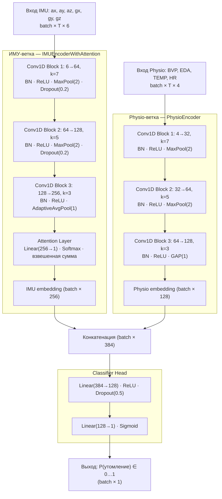

Разработка специализированной системы для определения степени физического переутомления спортсменов
П. А. Вершинин
Магистрант кафедры ЭВМ, ВятГУ, Киров, Россия,

# Аннотация

Рассмотрены методы диагностирования степени физического переутомления спортсменов с применением средств искусственного интеллекта. Выполнена классификация физиологических показателей, видов переутомления, технологий и архитектур интеллектуальных систем. Изучены нейросетевые и экспертные подходы, а также их комбинированные реализации. Проанализированы перспективы внедрения интеллектуальных диагностических систем в спортивной практике и медицинском сопровождении.

Ключевые слова: интеллектуальные системы, переутомление спортсменов, нейросети, экспертные системы, физиология, диагностика усталости, мониторинг, машинное обучение, носимые сенсоры, спортивная медицина

# Annotation

The methods of diagnosing the degree of physical fatigue of athletes with the use of artificial intelligence are considered. The classification of physiological indices, types of fatigue, technologies and architectures of intellectual systems is performed. Neural network and expert approaches, as well as their combined realization are studied. Prospects of implementation of intelligent diagnostic systems in sports practice and medical support are analyzed.

Keywords: intelligent systems, athlete fatigue, neural networks, expert systems, physiology, fatigue diagnosis, monitoring, machine learning, wearable sensors, sports medicine

# Введение 

> Не аргументирована актуальность темы, не раскрыты современные тенденции и вызовы в области диагностики переутомления спортсменов, не обоснован выбор методов и технологий для анализа. Необходимо более чётко сформулировать проблему, выделить ключевые аспекты и показать прикладную значимость исследования.

Современное развитие спорта высоких достижений, сопровождаемое ростом интенсивности тренировочных нагрузок, усложнением соревновательных циклов и ужесточением требований к функциональному состоянию спортсменов, предъявляет повышенные требования к системам мониторинга физической работоспособности и адаптации. В этих условиях вопросы объективной оценки степени физического переутомления приобретают особую актуальность как с точки зрения сохранения здоровья спортсменов, так и обеспечения устойчивой динамики их спортивных результатов.

Переутомление, являясь одним из наиболее распространённых факторов, ограничивающих адаптационные ресурсы организма, может проявляться в виде нарушений вегетативной регуляции, нейромышечной активности, когнитивных и мотивационных функций. Несвоевременное распознавание признаков утомления повышает риск развития синдрома перетренированности, травм и функционального истощения, что снижает эффективность тренировочного процесса и увеличивает восстановительный период. В условиях современного тренировочного цикла, характеризующегося высокой плотностью и вариативностью нагрузок, необходимость в оперативных, точных и индивидуализированных диагностических решениях становится критически важной [1].

На фоне цифровизации медицины и спорта, а также стремительного развития технологий искусственного интеллекта, возникает устойчивый тренд на внедрение интеллектуальных систем мониторинга, способных автоматически интерпретировать физиологические показатели и выявлять скрытые признаки утомления. Использование носимых сенсоров, биомеханических систем, нейросетевых моделей и алгоритмов машинного обучения открывает новые горизонты в области персонализированной диагностики функциональных состояний [2].

Особую значимость тема приобретает в свете задач внедрения технологий превентивной медицины, цифровых тренерских платформ и автоматизированных систем поддержки принятия решений в спортивной физиологии и реабилитации. Актуальность обусловлена также потребностью в интерпретируемых и верифицируемых инструментах, которые обеспечивают не только высокую чувствительность к физиологическим изменениям, но и интеграцию с существующей методологией спортивной подготовки.

Настоящий аналитический обзор направлен на систематизацию научно-технической информации, касающейся методов, программных решений, патентов и технологий, применяемых для построения интеллектуальных систем диагностики переутомления. В работе выполнена классификация подходов, выделены и проанализированы фундаментальные публикации, современные патенты и перспективные решения, реализующие технологии адаптивного мониторинга. Проведённый обзор позволяет обосновать выбор архитектурных и алгоритмических компонентов для проектирования специализированной системы оценки степени физического переутомления спортсменов, а также определить векторы дальнейших исследований и разработок.

# 1 Определение степени физического переутомления спортсменов 

Физическое переутомление спортсменов представляет собой специфическое функциональное состояние организма, возникающее вследствие чрезмерных тренировочных или соревновательных нагрузок, при котором наблюдается устойчивое снижение физической и психической работоспособности, а также нарушения вегетативной регуляции [3]. Длительное переутомление может привести к синдрому перетренированности и хроническим соматическим последствиям.

## 1.1 Основные подходы к определению степени переутомления

Диагностика степени физического переутомления спортсменов в современной науке базируется на совокупности субъективных и объективных методов, каждый из которых имеет различную степень точности, чувствительности к нагрузкам и пригодности для автоматизации и интеграции в интеллектуальные системы мониторинга. 

> Было: 1.1.1 Субъективные методы, 1.1.2 Объективные методы и т.д.
> При небольшом объеме информации применяют ненумерованные пункты. Три уровня иерархии применяются только в больших обзорах. В остальных случаях достаточно одного уровня заголовков.

Субъективные методы основаны на самооценке состояния спортсменом и включают в себя шкальные оценки, анкетирование и ведение дневников наблюдений. Наиболее распространённые методы:

- шкала Борга (RPE – Rate of Perceived Exertion) – 15-балльная шкала субъективной оценки интенсивности нагрузки. Позволяет спортсмену фиксировать ощущаемую тяжесть тренировки;
- опросники POMS (Profile of Mood States) – используется для выявления психоэмоционального состояния, включая усталость, подавленность, гнев, напряжение;
- анкета DALDA (Daily Analysis of Life Demands for Athletes) – фиксирует отклонения от нормального состояния, вызванные стрессом, тренировочной перегрузкой и внешними факторами.

К недостаткам субъективным подходам относятся высокая степень субъективности, возможность искажения данных в силу недооценки или переоценки состояния спортсменом, трудности в интерпретации без дополнительной объективной информации [4].

Объективные методы базируются на сборе физиологических, биохимических и нейропсихологических показателей с использованием сенсорных и лабораторных средств. Наиболее информативные параметры:

- HRV (Heart Rate Variability) – вариабельность сердечного ритма, отражающая баланс симпатической и парасимпатической активности. Снижение HRV свидетельствует о стрессовой реакции организма и возможной фазе переутомления;
- ЭМГ (Электромиография) – измерение электрической активности мышц. Снижение амплитуды сигналов или изменение частоты активации мышц указывает на нервно-мышечное истощение;
- температура тела и кожного покрова – незначительное повышение базовой температуры может сигнализировать о воспалительных процессах и утомлении;
- биомаркеры усталости: уровень лактата, креатинкиназы (CK), кортизола и тестостерона в крови. Например, увеличение соотношения кортизол/тестостерон указывает на катаболическое преобладание и перегрузку;
- когнитивные и моторные тесты – замедление реакции, снижение концентрации внимания и точности движений.

Объективные подходы имеют ряд преимуществ: высокая точность, возможность автоматизации, использование в интеллектуальных системах анализа состояния. Объективные методы широко применяются в спортивной медицине, в проектах «умной одежды», биомониторинга и цифровой физиологии [5]. 

Современные исследования ориентированы на интеграцию субъективных и объективных данных, объединяя информацию от носимых сенсоров, самооценки спортсмена и алгоритмов искусственного интеллекта. Такие системы обеспечивают:

- динамическую калибровку модели оценки утомления;
- индивидуализацию допустимого тренировочного воздействия;
- вывод интерпретируемых рекомендаций на основе комплексной оценки.

Примеры таких решений – Whoop Strap, Oura Ring, а также исследовательские прототипы с интеграцией ИИ, разрабатываемые в рамках патентных систем [5, 6].

## 1.2 Виды переутомления 

Физическое переутомление представляет собой сложный многофакторный процесс, затрагивающий физиологические, нейромышечные, когнитивные и метаболические системы организма. В спортивной физиологии выделяют несколько видов переутомления, различающихся по доминирующим механизмам нарушения гомеостаза и клинической картине [1, 7]. 

В таблице 1.1 представлена классификация видов переутомления с их краткой характеристикой и особенностями проявления.

Таблица 1.1 – Классификация видов переутомления

| № | Вид переутомления | Характеристика | Основные проявления |
| --- | ----------------- | ---------------- | ------------------- |
| 1 | Физиологическое | Возникает вследствие несоответствия между нагрузкой и уровнем восстановления | Снижение выносливости, усталость, снижение силы, ухудшение самочувствия |
| 2 | Нервно-мышечное | Возникает при дефиците нервно-мышечной передачи и сниженном рефлекторном ответе | Дрожь в мышцах, снижение точности движений, замедленная реакция, миофасциальное напряжение |
| 3 | Психоэмоциональное | Нарушение эмоционального состояния и когнитивных процессов вследствие накопленного стресс-фона | Раздражительность, апатия, тревожность, ухудшение мотивации и сна |
| 4 | Гормонально-метаболическое | Нарушения в эндокринной и энергетической регуляции, в том числе в синтезе гликогена, белков | Повышенный кортизол, снижение тестостерона, дисбаланс электролитов и обмена веществ |
| 5 | Кардиореспираторное | Нарушения в системах дыхания и кровообращения, часто наблюдаемые у выносливых спортсменов | Учащённое дыхание, тахикардия в покое, снижение VO₂max, нестабильный пульс |
| 6 | Сенсомоторное | Возникает при высокой плотности информации в тренировках, особенно с координационной нагрузкой | Нарушение двигательной точности, зрительно-моторная дискоординация |

## 1.3 Современные средства диагностики переутомления 

Развитие носимой электроники, телеметрии и технологий искусственного интеллекта привело к появлению новых поколений диагностических систем мониторинга утомления, позволяющих объективно фиксировать физиологические параметры спортсмена в реальном времени. Данные средства интегрируются как в повседневную тренировочную практику, так и в специализированные медицинские и научные исследования [3, 8].

Актуальные системы делятся на три основных класса:

- профессиональные медицинские системы (используются спортивными врачами и физиологами);
- потребительские носимые устройства (коммерческие браслеты, кольца, датчики);
- интеллектуальные НИР-разработки (системы с элементами ИИ, применяемые в исследованиях и прототипах).

В таблице 1.2 представлены примеры современных средств диагностики утомления спортсменов.

Таблица 1.2 – Примеры современных средств диагностики утомления спортсменов

| № | Название средства | Тип датчиков/показателей | Особенности и технологии |
| --- |-----------------|------------------------|-------------------------|
| 1 | Firstbeat Bodyguard 2 | HRV, дыхание, стресс | Медицинское устройство. Анализ восстановления и усталости |
| 2 | Whoop Strap 4.0 | Пульс, температура, дыхание, HRV | Прогноз утомления и готовности. Предиктивные алгоритмы |
| 3 | Oura Ring | Температура, пульс, качество сна | Анализ циркадных ритмов и восстановления организма |
| 4 | Garmin HRM-Pro Plus | Пульс, динамика движения, вариативность | Спортивный нагрудный монитор с мультиспортивной поддержкой |
| 5 | Hexoskin Smart Shirt | ЭКГ, дыхание, движения | Интеллектуальная одежда. Медицинская точность |
| 6 | Open-source IMU + EMG system | Акселерометры, гироскопы, электромиография | Используется в научных НИР с подключением нейросетей |

На рисунке 1.1 представлен интерфейс средства «Whoop Strap 4.0».

Рисунок 1.1 – Интерфейса приложения «Whoop Strap 4.0»

Современные системы диагностики физического переутомления характеризуются направленностью на объективную, непрерывную и индивидуализированную оценку функционального состояния спортсмена в условиях тренировочного и соревновательного процесса [2, 9]. Совокупность технологических решений и алгоритмов, применяемых в данных средствах, отражает переход к интеллектуализированным моделям мониторинга, интегрируемым в цифровую инфраструктуру спортивной медицины и адаптивного тренировочного планирования.

Ведущими особенностями данных средств являются:

- рост точности измерений за счёт комплексного применения мультиканальных сенсоров (электрокардиография, акселерометрия, фотоплетизмография, электромиография) и отказа от однокомпонентных метрик;
- интеграция нейросетевых и вероятностных моделей анализа, позволяющих учитывать нелинейные зависимости между физиологическими параметрами, утомлением и восстановлением;
- появление алгоритмов предиктивной аналитики, реализующих прогноз остаточной усталости, функциональной готовности и риска травм на основе накопленных данных;
- миниатюризация устройств и повышение автономности работы, что обеспечивает удобство использования в полевых условиях и при высокой подвижности спортсмена;
- облачная архитектура хранения и обработки данных, предоставляющая широкие возможности для удалённой интерпретации результатов, интеграции с системами управления тренировочным процессом, а также формирования цифрового профиля каждого спортсмена;
- персонализированный подход к интерпретации данных, включающий адаптацию алгоритмов оценки состояния с учётом пола, возраста, индивидуального анамнеза и вида спортивной деятельности.

В целом, данные тенденции способствуют формированию нового класса интеллектуальных систем поддержки принятия решений, способных в автоматическом режиме определять степень физического переутомления и выдавать рекомендации по коррекции тренировочного процесса. Актуальность таких решений особенно высока в контексте подготовки спортсменов высокого уровня, где недооценка признаков усталости может привести к срыву адаптации и снижению соревновательных результатов. 

# 2 Классификация методов, технологий и решений

## 2.1 Функциональная классификация методов

Функциональная классификация включает систематизацию методов и алгоритмов по их роли в обеспечении диагностики, интерпретации и прогноза степени физического переутомления спортсменов. Основу классификации составляют элементы, выполняющие ключевые задачи – от сбора физиологических данных до их анализа, прогнозирования и визуализации [4, 10]. В таблице 2.1 представлена функциональная классификация методов. Ниже приведено подробное описание каждого функционального блока.

Таблица 2.1 – Функциональная классификация методов

| Класс решений | Назначение и примерные технологии |
|----------------|--------------------------------|
| 1 Методы физиологической оценки | Измерение пульса, вариабельности сердечного ритма, ЭМГ, температуры тела, оксиметрии |
| 2 Алгоритмы анализа утомления | Модели детектирования, шкалы усталости, нейросетевые классификаторы |
| 3 Экспертные системы диагностики | Правила на основе порогов, логических решений, структурированных знаний |
| 4 Нейросетевые и машинные модели | RNN, CNN, SVM, градиентный бустинг, случайный лес |
| 5 Предиктивные модели риска перегрузки | Оценка вероятности травм, перетренированности, фаз восстановления |
| 6 Системы визуализации и обратной связи | Интерфейсы мониторинга, прогноз восстановления, индексы усталости |

Методы физиологической оценки представляют собой совокупность приёмов и алгоритмов для регистрации объективных биофизиологических показателей организма спортсмена в реальном времени. В их состав входят:

- анализ вариабельности сердечного ритма (HRV),
- измерение пульса, артериального давления, температуры тела,
- электромиография (ЭМГ) для оценки мышечной утомляемости,
- биохимические показатели (кортизол, тестостерон, лактат) при лабораторной поддержке,
- оценка дыхательных характеристик (частота и объём дыхания).

Данные методы обеспечивают количественную базу для последующей интеллектуальной обработки и выявления признаков усталости [2, 11].

Алгоритмы анализа утомления используются для выделения цепочек зависимостей (паттернов) и закономерностей, характеризующих развитие переутомления. Основу составляют:

- методы анализа временных рядов (например, wavelet-преобразование или автокорреляционный анализ);
- вычисление индексов усталости, интегральных коэффициентов напряжения;
- применение эвристических и эмпирических моделей.

Такие алгоритмы позволяют построить зависимости между характеристиками нагрузки и состоянием восстановления, выявлять критические отклонения и накапливать информацию для прогнозов [8, 12].

Экспертные системы диагностики базируются на формализованных знаниях, полученных от специалистов (врачей, тренеров, физиологов), и предназначены для интерпретации состояния спортсмена на основе заданных правил:

- использование логических деревьев решений;
- механизмы нечёткой логики (fuzzy logic);
- база знаний и продукционные правила (если–то–иначе).

Экспертные системы особенно полезны на этапе формирования прототипов, в условиях недостатка обучающих данных, а также для генерации объяснимых решений [13].

Нейросетевые и машинные модели ориентированы на автоматическое обучение закономерностям в данных и предсказание состояний без явного программирования логики. Наиболее распространённые подходы:

- искусственные нейронные сети (ANN);
- сверточные сети (CNN) для обработки сигналов и изображений;
- рекуррентные сети (LSTM, GRU) для анализа временных рядов;
- алгоритмы градиентного бустинга (XGBoost, CatBoost);
- метод опорных векторов (SVM) и деревья решений.

Обучаемые модели позволяют достигать высокой точности в классификации стадий усталости, персонализируя результаты под конкретного спортсмена [14].

Предиктивные модели риска перегрузки позволяют прогнозировать вероятность наступления переутомления и связанных с ним негативных состояний:

- регрессионные модели оценки остаточной усталости;
- байесовские сети вероятностей наступления риска травм;
- временные модели прогнозирования восстановления, например ARIMA, Prophet).

В спортивной практике такие модели используются при планировании тренировочной нагрузки, позволяя минимизировать вероятность травматизма и перетренированности [15].

Системы визуализации и обратной связи обеспечивают удобное представление диагностических данных и результатов анализа пользователю, например: спортсмену, тренеру, врачу. Применяются:

- интерактивные графики динамики параметров (HRV, пульс, активность);
- индексы восстановления и усталости (например, "статус готовности");
- уведомления на мобильные устройства, голосовые рекомендации;
- дашборды с агрегированными показателями в реальном времени.

Визуализация повышает интерпретируемость решений, способствует оперативному реагированию и использованию системы в тренировочной среде [16].

## 2.2 Классификация по типу технологий

Технологии, используемые в системах диагностики и мониторинга физического переутомления, охватывают широкий спектр решений, включая аппаратные компоненты, каналы передачи данных, алгоритмы обработки информации, вычислительные архитектуры и интеллектуальные методы анализа [17]. 
На рисунке 2.1 представлено классификация по типу технологий.

Рисунок 2.1 – Классификация по типу технологий

Категория носимые сенсорные технологии (Wearable Sensors) включает устройства и датчики, обеспечивающие непрерывный сбор физиологических и кинематических параметров. К числу наиболее распространённых сенсоров относятся:

- фотоплетизмографические датчики (PPG) – измерение частоты сердечных сокращений, насыщения крови кислородом (SpO₂);
- электрокардиографические сенсоры (ЭКГ) – точное определение вариабельности сердечного ритма (HRV);
- инерциальные модули (IMU: акселерометр, гироскоп, магнитометр) – оценка двигательной активности, постурального контроля и координации;
- электромиографические сенсоры (ЭМГ) – регистрация мышечной активности и утомляемости;
- датчики температуры, давления, влажности кожи – фиксация терморегуляции и водно-солевого баланса.

Сенсоры могут быть интегрированы в браслеты, майки, обувь, налобные крепления или медицинские пластыри [18].

Технологии беспроводной передачи данных обеспечивают связь между сенсорными модулями, мобильными устройствами и облачными хранилищами. Используются:

- Bluetooth Low Energy (BLE) – энергосберегающий стандарт для передачи данных между носимыми устройствами и смартфоном.
- ANT+ – специализированный протокол для спортивных гаджетов, часто используется в нагрудных пульсометрах;
- Wi-Fi / LTE / 5G – высокоскоростная передача больших объёмов данных в реальном времени, например потоковая ЭКГ или ЭМГ;
- ZigBee / LoRa – для распределённых сенсорных сетей с низким энергопотреблением.

Устойчивость канала, задержки, помехоустойчивость и безопасность – ключевые параметры оценки эффективности протокола в спортивной среде [19].

Мобильные и облачные вычислительные платформы. Современные системы диагностики утомления опираются на гибридные архитектуры обработки данных:

- edge-обработка – предварительная фильтрация и анализ данных на локальном устройстве (например, в фитнес-браслете), что снижает задержки и нагрузку на сеть;
- облачная обработка (Cloud AI/ML) – хранение истории, обучение моделей, централизованная аналитика. Используются API-платформы (AWS, Azure AI, Google Cloud);
- мобильные платформы – реализация пользовательских интерфейсов, визуализация состояния, управление сеансами мониторинга;

Такие архитектуры позволяют масштабировать систему, обеспечивать персонализацию и непрерывную синхронизацию данных [10].

Алгоритмы обработки биосигналов для повышения информативности сигналов и подготовки данных к интеллектуальному анализу применяются:

- фильтрация и нормализация – подавление артефактов, сглаживание шумов, выравнивание по амплитуде и частоте;
- фурье-преобразование (FFT) – спектральный анализ ЭМГ, дыхания, тремора;
- вейвлет-анализ – извлечение локальных особенностей сигналов с высокой временной разрешающей способностью;
- детекторы пиков и окон – используется в HRV, ЭКГ и ЭМГ-анализе.

Данные методы обеспечивают корректную обработку многомерных временных рядов и повышают точность последующего классифицирования [9].

Интеллектуальные модели анализа (AI/ML) применяются для автоматической интерпретации, классификации и прогнозирования состояния утомления:

- методы машинного обучения – логистическая регрессия, SVM, деревья решений, k-NN;
- глубокое обучение (Deep Learning) – сверточные сети (CNN), рекуррентные сети (LSTM, GRU), трансформеры;
- гибридные модели – ансамбли алгоритмов, каскадные решения с экспертной логикой.

Особое значение имеет способность алгоритма к обобщению, адаптации к индивидуальному физиологическому фону и объяснимости результатов [9, 16].

## 2.3 Классификация по архитектурным подходам

Архитектура программно-аппаратных комплексов, реализующих функции мониторинга и диагностики переутомления спортсменов, определяется особенностями источников данных, требованиями к обработке, условиями эксплуатации и необходимым уровнем автономности. 

На рисунке 2.2 представлена архитектурная классификация систем диагностики переутомления спортсменов.

Рисунок 2.2 – Архитектурная классификация систем диагностики переутомления

В зависимости от степени распределённости, локализации вычислений и уровня интеграции с ИИ-моделями, выделяются следующие типы архитектур.

Локальные моно-сенсорные системы наиболее простые по реализации решения, основанные на использовании одного физиологического сенсора, например фотоплетизмографа, пульсометра или ЭКГ-модуля.

Особенности:

- минимальный набор компонентов (сенсор + мобильное приложение);
- локальный сбор данных без комплексной аналитики;
- ограниченный функционал (обычно только определение ЧСС, вариабельности пульса).

К преимуществам относятся: простота, автономность, низкая стоимость.

К недостаткам: низкая точность, отсутствие корреляции с другими параметрами, невозможность анализа сложных состояний [20].

Мультисенсорные распределённые системы – комплексы, объединяющие несколько сенсоров, размещённых на теле спортсмена (IMU, ЭМГ, GSR, пульс, дыхание), с передачей данных в центральный блок или сервер.

Особенности:

- высокая точность диагностики за счёт комплексной картины;
- поддержка пространственно-временного анализа и межсигнальных зависимостей;
- возможность адаптации под конкретный вид спорта.

Данные решения применяют в областях: системы типа Hexoskin, custom-решения в НИР, лаборатории спортивной физиологии. 

К существенным недостаткам относятся высокая стоимость, энергозависимость, сложность настройки [21].

Edge-ориентированные архитектуры – системы, в которых предварительная обработка данных, классификация и принятие решений выполняются непосредственно на носимом устройстве (edge computing), без постоянного подключения к серверу.

Преимущества:

- работа в автономном режиме;
- быстрая реакция (низкие задержки);
- высокий уровень приватности данных.

Типичные компоненты:

- микроконтроллер с ИИ-модулем (например, nRF52 + TensorFlow Lite);
- алгоритмы компрессии и адаптивной фильтрации;
- BLE или Wi-Fi модуль передачи в облако при необходимости.

Применяются в носимых браслетах, «умной» одежде, нагрудных модулях [22].

Облачные и серверно-центричные архитектуры – системы, в которых вся основная обработка и хранение данных, а также обучение моделей машинного обучения, производится на внешних серверах (облачных или локальных).

Компоненты:

- облачное хранилище (Google Cloud, AWS, Яндекс Облако);
- централизованные модели ИИ и визуализация через веб-интерфейс;
- API-интеграции с мобильными и настольными клиентами.
Преимущества:
- возможность масштабирования и накопления больших массивов данных;
- высокая вычислительная мощность для сложных моделей (например, LSTM);
- удалённый доступ для тренеров, врачей и исследователей.

К существенным недостаткам относятся: зависимость от подключения, повышенные требования к защите персональных данных [23]. 

В таблице 2.2 представлена сравнительная характеристика архитектурных решений.

Таблица 2.2 – Сравнительная характеристика архитектурных решений

| Тип | Вычисление | Датчик | Применение | Примечание |
|------|------------|--------|------------|------------|
| Моно-сенсорная локальная | На устройстве | Пульс, HRV | Фитнес-браслеты, массовый спорт | Базовый уровень диагностики |
| Мультисенсорная распределённая | Частично облако | IMU, ЭМГ, GSR, ЭКГ | Спортивная медицина, лаборатории | Высокая точность, требовательность к настройке |
| Edge-ориентированная | Встроенное устройство | IMU, PPG, ЭМГ | Полевые условия, носимые решения | Автономность, быстрое реагирование |
| Облачная | В облаке | Все виды | Персонализированные цифровые платформы | Высокие ресурсы, сложная инфраструктура |

Сравнительная характеристика архитектурных подходов демонстрирует, что моно-сенсорные локальные системы применимы преимущественно в бытовом и любительском спорте, обеспечивая базовую диагностику при минимальных ресурсах. Однако, их диагностическая ценность ограничена из-за недостаточной информативности и отсутствия комплексного анализа.

Мультисенсорные распределённые решения обеспечивают наивысочную точность, позволяя проводить кросс-валидацию между разными физиологическими показателями. Такие архитектуры целесообразны при построении профессиональных и медицинских систем мониторинга, но требуют сложной настройки и ресурсной инфраструктуры.

Edge-архитектуры представляют собой компромисс между автономностью и вычислительной мощностью. Данные решения обеспечивают локальный анализ в реальном времени и особенно эффективны в условиях с ограниченным или нестабильным подключением к сети.

Облачные архитектуры обладают высокой масштабируемостью и обеспечивают накопление данных для последующего обучения ИИ-моделей. Такие решения целесообразны при реализации персонализированных платформ длительного мониторинга и анализа в спортивной медицине.

Таким образом, выбор архитектурного решения определяется конкретным сценарием применения: от бытовых трекеров до высокоточных экспертных систем. При проектировании системы оценки переутомления спортсменов целесообразно ориентироваться на гибридную архитектуру, сочетающую edge-компоненты для первичной обработки и облачную инфраструктуру для аналитики и персонализации.

# 3 Методы диагностирования переутомления спортсмена

Развитие искусственного интеллекта (AI) и его внедрение в биомедицинские и спортивно-аналитические задачи открывает новые возможности для создания интеллектуальных систем оценки физиологического состояния спортсменов. Современные методы диагностирования переутомления включают комбинации математических моделей, логических систем принятия решений, а также самообучающихся нейросетевых архитектур.

## 3.1 Нейросетевые подходы

Нейросетевые методы представляют собой один из наиболее перспективных подходов к диагностике и прогнозированию физического переутомления спортсменов. Актуальность применения нейросетей обусловлена их способностью к обучению на высокоразмерных, шумных и нелинейных данных, к числу которых относятся физиологические сигналы: электромиография, вариабельность сердечного ритма, показатели дыхания, терморегуляции, параметры локомоции и прочие биомаркеры функционального состояния организма.

Среди моделей, находящих наибольшее применение, следует выделить сверточные нейронные сети (CNN), рекуррентные архитектуры (LSTM, GRU), а также гибридные модели, сочетающие преимущества пространственного и временного анализа. CNN-преобразования позволяют эффективно извлекать локальные особенности из сигналов, представленных в форме спектрограмм или двумерных матриц, что особенно эффективно при обработке ЭМГ и ЭКГ. Рекуррентные сети обеспечивают захват временной динамики показателей, отслеживая длительные зависимости и последовательные изменения, характерные для процессов развития усталости и восстановления [11, 13].

Кроме классических архитектур, активно внедряются автоэнкодеры для выявления скрытых закономерностей в пространстве признаков, а также attention-механизмы и трансформеры, демонстрирующие высокую производительность при работе с длительными временными рядами, включая серию тренировочных и восстановительных циклов.

Обучение нейросетей выполняется на размеченных наборах данных, включающих многоканальные сигналы, аннотированные по уровням утомления, например: «норма», «начальная усталость», «острое переутомление». В качестве меток используются как субъективные шкалы (RPE, POMS), так и объективные пороговые значения физиологических параметров (падение HRV, рост ЭМГ-активности, снижение VO₂max и др.). Для повышения точности классификации применяются методы балансировки классов, аугментации временных рядов и регуляризации. 

Практическая реализация нейросетевых моделей осуществляется в виде встроенных модулей в edge-устройствах, например браслеты, «умные» майки, или в составе облачных аналитических платформ, где происходит как онлайн-обработка сигналов, так и офлайн-обучение моделей. Использование нейросетевых подходов позволяет не только распознавать факт переутомления, но и строить персонализированные модели реакции на тренировочные воздействия, выявлять ранние признаки перетренированности, а также предлагать корректирующие рекомендации в автоматическом режиме [14].

На рисунке 3.1 представлен процесс сбора и преобразования физиологических сигналов для прогнозирования усталости с использованием ИИ.

 
Рисунок 3.1 – Процесс сбора и преобразования физиологических сигналов для прогнозирования усталости с использованием ИИ

Примером конкретной реализации двухветочной CNN-архитектуры для задачи диагностики утомления по данным запястного сенсора служит модель FatigueWristNet (v7.0). Архитектура объединяет два независимых энкодера — для инерциальных данных (IMU: ось ускорения и гироскоп) и физиологических показателей (Physio: BVP, EDA, температура, ЧСС) — с последующим слиянием признаковых векторов в классифицирующей голове (рисунок 3.2).

Рисунок 3.2 – Архитектура модели FatigueWristNet v7.0

Эффективность нейросетевых решений подтверждена в ряде экспериментальных исследований, где достигнута точность классификации выше 90% при анализе многомодальных данных. Таким образом, применение глубинного обучения обеспечивает основу для построения интеллектуальных адаптивных систем диагностики утомления спортсменов, обладающих высокой чувствительностью и способностью к непрерывному самообучению.

## 3.2 Диагностические экспертные системы

Диагностические экспертные системы представляют собой программные комплексы, реализующие процедуры распознавания и оценки состояния объекта управления на основе заложенных знаний и логических правил. В контексте мониторинга переутомления спортсменов такие системы позволяют формализовать опыт врачей и тренеров, интерпретировать данные в условиях неопределённости и недостатка обучающих выборок, а также обеспечить объяснимость принимаемых решений.

Классическая структура экспертной системы включает следующие компоненты: база знаний, содержащая описание симптомов и правил вывода; машина вывода, реализующая логический вывод на основе текущих данных; рабочая память, где формируются промежуточные заключения; а также интерфейс пользователя, обеспечивающий визуализацию результатов и взаимодействие с системой [2, 4].

Основу экспертных систем составляют продукционные правила вида:
ЕСЛИ [условие] ТО [действие], например: «ЕСЛИ HRV < 30 мс И частота дыхания > 25 в мин И длительность сна < 6 ч, ТО высокая вероятность переутомления». 

Применение нечёткой логики (fuzzy logic) расширяет возможности системы, позволяя работать с нестрогими, лингвистическими переменными и формулировать заключения в форме «умеренный риск», «пограничное состояние», «нужен отдых». Особенно важно в физиологии, где состояния организма не имеют чётко выраженных границ, а переходы между фазами утомления являются постепенными и индивидуальными.

На рисунке 3.3 представлена блок-схема, иллюстрирующая примерный способ работы механизма идентификации усталости.

Рисунок 3.3 – Блок-схема примерной диагностической экспертной системы

Диагностические экспертные системы классифицируются на:

- моноуровневые, основанные на простых логических правилах и конкретных физиологических индикаторах (HRV, ЭМГ, температура тела);
- многоуровневые, в которых происходит обобщение данных с различных уровней (биомеханика, нейрофизиология, психоэмоциональное состояние) и формируется агрегированное решение;
- гибридные, сочетающие экспертные блоки с модулями машинного обучения, выполняющими предварительную обработку и классификацию входных данных.

Преимуществами таких систем являются: высокая интерпретируемость, возможность адаптации под конкретные протоколы тренировок и видов спорта, устойчивость к небольшим объёмам данных, а также интеграция с интерфейсами тренеров и медицинских специалистов. Недостатками следует считать ограниченность знаний в базе при старте разработки, сложность формализации биологических процессов и необходимость постоянного сопровождения и обновления базы знаний.

На практике диагностические экспертные системы используются в спортивной медицине для:

- определения уровня восстановления перед тренировкой;
- оценки допустимого объёма нагрузки;
- прогнозирования риска перенапряжения и травматизации;
- формирования индивидуальных рекомендаций и коррекции тренировочного плана.

Системы данного класса демонстрируют высокую эффективность при интеграции с носимыми сенсорами, базами мониторинга, модулями контроля сна и когнитивного состояния. Данные системы особенно актуальны для командных видов спорта, реабилитационных программ и дистанционного медицинского сопровождения, где требуется доступ к объяснимому и верифицируемому заключению на основе наблюдаемых признаков [8].

## 3.3 Комбинированные (гибридные) интеллектуальные системы

Комбинированные интеллектуальные системы представляют собой программно-аналитические комплексы, сочетающие в своей структуре возможности самообучающихся нейросетевых моделей и интерпретируемых диагностических экспертных подсистем. Основное назначение таких решений заключается в повышении надёжности и объяснимости выводов при сохранении высокой чувствительности к сложным, многомерным данным, характерным для физиологических сигналов и показателей усталости [2].

Гибридная архитектура включает два взаимосвязанных уровня анализа:

- на первом уровне применяется глубокая нейронная модель, предназначенная для извлечения информативных признаков из временных и сенсорных данных, их классификации и прогнозирования состояния переутомления;
- на втором уровне функционирует экспертная надстройка, интерпретирующая результаты нейросетевого анализа с учётом контекстных факторов, истории спортсмена, индивидуальных физиологических норм и порогов.

Такая структура обеспечивает баланс между адаптивностью и контролируемостью модели. Нейросетевой компонент формирует первичный вывод на основе данных, собранных с сенсорных устройств (пульс, вариабельность сердечного ритма, электромиография, параметры дыхания и температуры). Далее экспертный модуль, использующий набор правил и ограничений, валидирует или корректирует полученное заключение, учитывая возможные аномалии, кратковременные искажения или специфические физиологические особенности индивидуума.

Комбинированные системы нередко используют механизм обратной связи, позволяющий уточнять правила в базе знаний на основе статистики решений нейросети, и наоборот — модифицировать весовые коэффициенты модели с учётом экспертных заключений (например, путём регуляризации или мягкого наложения ограничений на вероятности).

Примером реализации может служить система, в которой CNN+LSTM анализирует спектрограммы ЭМГ и вариабельность ЧСС, формируя первичное заключение, а модуль fuzzy-логики оценивает, соответствует ли выявленное состояние усталости допустимым тренировочным рамкам для текущего цикла нагрузки. В случае превышения индивидуального индекса утомления система инициирует рекомендации по корректировке тренировочного плана [10, 17].

На рисунке 3.4 представлен пример реализации комбинированного подхода.

Рисунок 3.4 – Этапы гибридной интеллектуальной системы, пример

К числу преимуществ гибридных систем относятся:

- высокая адаптивность к индивидуальным физиологическим характеристикам;
- повышение доверия пользователя за счёт интерпретируемости выводов;
- устойчивость к шуму и единичным выбросам в сенсорных данных;
- возможность масштабирования и дообучения при накоплении данных.

Подобные архитектуры широко применяются в задачах персонализированной медицины, спортивной аналитики и систем поддержки принятия решений в реабилитации. Их актуальность обусловлена необходимостью объединить вычислительную мощность нейросетей и логическую строгость экспертных правил в условиях высокой ответственности и ограниченной объяснимости автономных ИИ-систем.

## 3.4 Выводы по интеллектуальным методам диагностики переутомления

Проведённый анализ современных методов диагностики физического переутомления спортсменов, основанных на применении искусственного интеллекта, позволяет выделить три устойчиво развивающихся подхода: нейросетевые технологии, диагностические экспертные системы и комбинированные (гибридные) интеллектуальные архитектуры. Каждый из перечисленных классов решений демонстрирует как высокую прикладную значимость, так и специфику применимости в условиях реального тренировочного и соревновательного процесса.

Нейросетевые подходы доказали эффективность в задаче извлечения скрытых закономерностей и паттернов утомления из комплексных, многоканальных и неструктурированных физиологических сигналов. Использование архитектур глубокого обучения (CNN, LSTM, GRU) обеспечивает высокую точность классификации, адаптацию к индивидуальным особенностям спортсмена и возможность построения персонализированных моделей. Однако сложность интерпретации результатов и необходимость значительного объёма обучающих данных ограничивают их применение в условиях, где требуется объяснимость вывода и прозрачность диагностических решений.

Диагностические экспертные системы, построенные на базе логических правил и нечетких выводов, обладают высокой интерпретируемостью, устойчивостью к нехватке данных и удобством внедрения в практику спортивной медицины. Возможность формализации знаний специалистов позволяет применять такие системы в реабилитации, отборе нагрузки и рутинной тренировочной диагностике. При этом недостаточная гибкость, ограниченность базы знаний и неспособность к адаптации к новым паттернам утомления сдерживают их развитие как самостоятельных решений в высокодинамичной среде.

Комбинированные интеллектуальные системы, объединяющие в своей структуре элементы нейросетевого анализа и экспертной логики, представляют собой наиболее перспективное направление. Такие решения обеспечивают высокий уровень адаптивности, способность к самообучению, а также сохранение объяснимости вывода за счёт экспертной надстройки. Гибридная архитектура позволяет реализовать интеллектуальный контроль состояния спортсмена в режиме реального времени с учётом физиологических, биомеханических и поведенческих факторов.

На основании анализа текущих трендов и практических реализаций можно сделать вывод, что в задачах диагностики переутомления спортсменов наиболее обоснованным является выбор в пользу гибридных архитектур, сочетающих возможности глубокого обучения и экспертного моделирования. Такие системы позволяют достигать требуемого баланса между точностью, устойчивостью, персонализацией и медицинской интерпретируемостью результатов, что критически важно в спортивной физиологии, где цена диагностической ошибки может быть высокой.

# 4 Перспективы внедрения интеллектуальных систем диагностики переутомления

Внедрение интеллектуальных систем диагностики переутомления в спортивную практику представляет собой одно из ключевых направлений цифровизации физиологического мониторинга и автоматизации процессов адаптивного управления тренировочной нагрузкой. Высокий уровень интеграции сенсорных технологий, алгоритмов машинного обучения и экспертной логики открывает широкие перспективы для использования таких решений как в индивидуальной подготовке спортсменов, так и в рамках комплексного медицинского сопровождения сборных команд и профессиональных клубов.

Согласно недавнему поиску «Engineering Village», в период с 2015 по 2024 год было опубликовано более 8000 статей по теме измерения и обнаружения усталости на основе медицинских или физиологических данных человека, рисунок 4.1.

Интеллектуальные системы способны обеспечить непрерывный контроль физиологического состояния, своевременно выявлять критические отклонения от норм адаптации и формировать рекомендации по коррекции тренировочных воздействий в зависимости от уровня утомления, темпов восстановления и особенностей текущего микроцикла. Применение таких решений позволит значительно снизить риски перетренированности, микротравм, синдрома выгорания и других негативных последствий чрезмерной нагрузки, сохранив при этом динамику спортивного прогресса.

Внедрение систем с элементами нейросетевого анализа и экспертных модулей возможно в следующих форматах: автономные мобильные приложения с интеграцией с носимыми устройствами; облачные платформы с персонализированным доступом для тренера и врача; компоненты цифровой экосистемы в рамках «умной» тренировочной инфраструктуры; модули оценки готовности в реабилитационных или восстановительных комплексах. При этом особое значение приобретает возможность калибровки моделей под индивидуальные физиологические нормы спортсмена, с учётом анамнеза, спортивной специализации и этапа подготовки.

Индустриально важными направлениями применения являются высокоэффективный спорт, адаптивная физическая культура, спортивная медицина, а также военно-прикладная и профессионально ориентированная подготовка, где контроль функционального состояния является критически важным элементом. Потенциал применения также существует в образовательных и научных учреждениях в рамках подготовки специалистов по физиологии, биоинформатике, спортивной аналитике и медицинскому ИИ [31].

Рисунок 4.1 – Опубликованные исследования за период с 2015 по 2024 год касались выявления усталости с использованием физиологических данных

Основными барьерами внедрения остаются: ограниченность обучающих выборок в закрытых видах спорта, необходимость соблюдения требований по защите персональных биометрических данных, высокая чувствительность систем к калибровке сенсоров, а также потребность в междисциплинарной подготовке специалистов для сопровождения таких решений.

Несмотря на существующие ограничения, интеллектуальные системы диагностики переутомления обладают высоким уровнем технологической зрелости и потенциалом масштабирования. В ближайшей перспективе можно ожидать их интеграции в государственные системы спортивной медицины, включения в нормативно-методические комплексы подготовки спортсменов, а также появления на коммерческом рынке спортивной аналитики и персонализированного мониторинга функционального состояния.

# Заключение

> Заключение слабо отражает результаты проведённого анализа, не содержит конкретных выводов и рекомендаций, а также не демонстрирует прикладную значимость выполненной работы. Необходимо более чётко сформулировать основные итоги исследования, выделить ключевые достижения и обозначить перспективы практического применения полученных результатов.

Проведённый аналитический обзор научно-технической информации по теме «Разработка специализированной системы для определения степени физического переутомления спортсменов» позволил системно раскрыть современное состояние исследований в области интеллектуальных методов диагностики утомления и сформировать структурированную методологическую базу для проектирования прикладных решений. В ходе работы проанализированы фундаментальные публикации, статьи, патенты, диссертации и конференционные материалы, касающиеся применения искусственного интеллекта в спортивной физиологии, диагностике утомления, а также технических решений на базе носимых сенсоров и экспертных алгоритмов.

В результате проведённой классификации методов были выделены ключевые подходы к диагностике переутомления: нейросетевые, экспертные и гибридные интеллектуальные системы. Для каждого класса решений выполнен подробный функциональный и архитектурный анализ, приведены схемы потоков обработки информации и диаграммы архитектурных компонентов, предложены обоснования их применимости в различных условиях мониторинга, в том числе в реальном времени. Установлено, что наиболее перспективным является гибридный подход, обеспечивающий адаптивность, точность и интерпретируемость выводов при диагностике сложных физиологических состояний.

Также рассмотрены основные физиологические параметры, используемые в системах мониторинга, включая вариабельность сердечного ритма, электромиографические сигналы, параметры дыхания и терморегуляции. Выполнена классификация видов переутомления, определены основные признаки и маркеры, использующиеся в современных интеллектуальных системах для анализа утомления. Приведён обзор существующих коммерческих и исследовательских платформ, реализующих принципы физиологического анализа и машинного обучения.

В качестве инструмента визуализации и систематизации материала в работе использованы таблицы сравнений, структурные блоки и архитектурные диаграммы. На их основе сформированы рекомендации по выбору методов диагностики, технических компонентов и логики принятия решений при проектировании интеллектуальной системы мониторинга спортсменов.

Таким образом, выполненная работа демонстрирует высокую степень проработки научно-технической базы, необходимой для последующего этапа – практической разработки программно-аппаратного комплекса оценки степени физического переутомления. Обзор обладает высокой степенью прикладной значимости и может быть использован в спортивной медицине, физиологии, инженерных и образовательных проектах, направленных на развитие интеллектуальных технологий в сфере охраны здоровья и повышения спортивной результативности.

# Список использованных источников информации 

> Должен быть ГОСТ Р7.0.5-2008 (используется в научных публикациях)

1. Граевская, Н. Д., Долматова Т. И. Спортивная медицина : учебное пособие. М. : Спорт, Человек, 2018. 712 с.
2. Гаврилова Т. А., Хорошевский В. Ф. Базы знаний интеллектуальных систем. СПб. : Питер, 2001. 384 с.
3. Li R., Wang S., Zhang Y. Fatigue Monitoring Using Wearables and AI: Trends, Challenges, and Future Directions // Proceedings of the 2024 International Conference on Artificial Intelligence (ICAI), 2024. Pp. 1–10.
4. Костров Б. В., Ручкин В. А. Основы искусственного интеллекта. М. : ДЕСС, ТехБук, 2007. 192 с.
5. Уилмор Дж., Костилл Д. Физиология спорта и физических упражнений. / пер. с англ. под ред. С. В. Павлова. К. : Олимпийская литература, 2019. 648 с.
6. Чертилина А. А., Мокшин В. В. Использование методов машинного обучения в медицине. // Материалы XXII Международной научно-практической конференции им. Э. К. Алгазинова. 2022. С. 787–793.
7. Силен Дэви, Мейсман Арно, Али Мохамед Основы Data Science и Big Data. Python и наука о данных. / пер. с англ. СПб.: Питер, 2017. 336 с.
8. Элти Дж., Кумбс М. Экспертные системы: концепции и примеры. / пер. с англ. и предисл. Б. И. Шитикова. М.: Финансы и статистика, 1987. 191 с.
9. Гусев А. В., Добриднюк С. Л. Искусственный интеллект в медицине и здравоохранении. // Вестник новых медицинских технологий. 2020. Т. 4, № 5. С. 78–79.
10. Евменов В. П. Интеллектуальные технологии и представления знаний: учебное пособие. СПб. : Политехнический университет, 2007. 301 с.
11. Hassoun M. H. Fundamentals of Artificial Neural Networks. Cambridge: MIT Press, 1995. 511 Pр.
12. Шутов Д. В., Шарова Д. Е., Абуладзе Л. Р. Системы искусственного интеллекта в клинической физиологии: как сделать их обучение эффективным? // Цифровая диагностика, 2023. Т. 4, № 1. С. 81–88.
13. González J. A., Rodríguez M. C., Pérez A. M. Fatigue evaluation through machine learning and a global fatigue descriptor // Computational Intelligence and Neuroscience. 2020. V. 2020, Article ID 6484129. Pp. 125–170.
14. Wu M.-Y., Chen C.-H., Lo C.-C. An Exercise Fatigue Detection Model Based on Machine Learning Methods // Proceedings of the 2018 International Conference on Machine Learning and Cybernetics (ICMLC). 2018. Pp. 1–6.
15. Arunkumar A., Surendran D., Sreya S. AI-Assisted Fatigue and Stamina Control for Performance Sports on IMU-Generated Multivariate Time Series Data // Proceedings of the 2023 International Conference on Sensors (SENSORS). 2023. Pp. 1–6.
16. Shen D. AI based fatigue assessment system for athletes using smart textile wearables: diss. Thèse en cotutelle pour obtenir le grade de Docteur en Informatique, Automatique. Université de Lille, Université de Donghua. Lille, 2024. 202 p.
17. Li A. Real-Time Athlete Fatigue Monitoring Using Fuzzy Decision Support Systems // Proceedings of the 2025 International Conference on Computational Intelligence Systems (ICCIS). 2025. Pp. 1–8. 
18. Перова В. И., Летягина Е. Н., Башмуров Н. А. Применение искусственных нейронных сетей в анализе развития физической культуры и спорта // Сборник тезисов VII Всероссийской с международным участием научно-практической конференции «День спортивной информатики», 4–5 декабря 2023 г. М. : 2024. 119 с.
19. Рябенков Р. А., Михеев И. В. Глубокое обучение // Сборник трудов II Международной научно-практической конференции «Современные технологии и автоматизация в технике, управлении и образовании». М. : НИЯУ МИФИ, 2020. 
20. Черепанов Ф. М. Методы повышения эффективности нейросетевых рекомендательных систем в условиях ограниченных объёмов выборок со сложными корреляционными связями. Пермь : ПНИПУ, 2019. 136 с.
21. System and method for athlete physiology monitoring: Pat. №: US 2020/0093435 A1 Unites States. / Radi Masri, II James Edward Whitney, Michael Wright. №: US16/582,071; Appl. 25.09.2019; Publ. 26.03.2020. 15 p.
22. AI or ML Model Monitoring Method and Apparatus: Pat. №: WO 2024/092812 A1 China. / Zhang Wei, Li Ming. №: PCT/CN2022/130112; Appl. 10.05.2024; Publ. 10.05.2024. 22 p.
23. System of an artificial intelligence (AI) powered wireless gym: Pat. №: US 2020/0353314 A1 United States. / Messinger Samuel. №: US16/403,645; Appl. 06.05.2019; Publ. 20.03.2021. 28 p.
