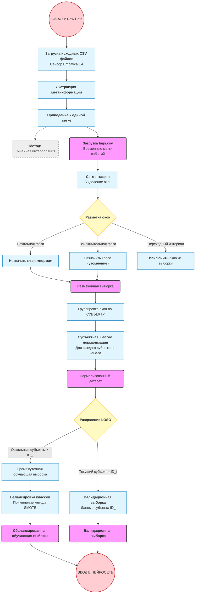

# Отчет по производственной практике 

> По всему тексту
> Заменить слова "ресемплинг" на "приведение к единой частоте дискретизации", так как ресемплинг может восприниматься как термин, связанный с аудио- или видеообработкой, что не совсем корректно для временных рядов физиологических данных. В данном случае речь идёт о том, что все сигналы приводятся к единой частоте дискретизации 100 отсчётов на окно, что достигается с помощью метода линейной интерполяции. Проверить по всему тексту статьи, что термин "ресемплинг" заменён на более точное описание процесса приведения к единой частоте дискретизации.
> Заменить слова паттерны на "структуры", так как термин "паттерны" может быть воспринят как неформальный, в то время как "структуры" более точно отражает идею выявления устойчивых закономерностей в данных, что соответствует научному стилю статьи. В данном случае речь идёт о том, что модель выявляет сложные нелинейные зависимости и устойчивые структуры в многоканальных физиологических данных, что позволяет эффективно классифицировать состояние переутомления.
> Знак `=` заменить на "равно" в тексте, так как использование знака `=` в тексте статьи может восприниматься как неформальное, тогда как "равно" более соответствует научному стилю. Знак `=` применяется только в формулах, а в тексте статьи следует использовать слово "равно" для обозначения равенства между величинами. Например, вместо "F1-macro = 0,826" следует писать "F1-macro равно 0,826" или "равной".
> Круглые скобки использовать только для сокращений в тексте, или в формулах. Пример: convolution neural network (CNN), recurrent neural network (RNN), long short-term memory (LSTM), gated recurrent unit (GRU). В остальных случаях следует избегать использования круглых скобок, перефразировать, переделать предложение так, чтобы не требовалось использование скобок. Например, вместо "входное окно разделяется на инерциальную компоненту (акселерометр, гироскоп) и физиологическую компоненту (BVP, EDA, TEMP, HR)" можно написать "входное окно разделяется на инерциальную компоненту, включающую данные акселерометра и гироскопа, и физиологическую компоненту, включающую данные BVP, EDA, TEMP и HR".
> Списки в тексте оформлять в виде абзацев с использованием тире или нумерации, а не в виде маркированных списков. И если список продолжается ставить ";", если конец списка ставиться ".". Например, вместо:
> - шкала Борга – 15-балльная шкала субъективной оценки интенсивности нагрузки. Позволяет спортсмену фиксировать ощущаемую тяжесть тренировки;
> - опросники POMS – используется для выявления психоэмоционального состояния, включая усталость, подавленность, гнев, напряжение.
> В тексте следует не указывать математические формулы, по возможности выносить в отдельный блок и обращаться к ним по номеру. Например, вместо "Функция потерь Focal Loss определяется как FL(p_t) = -α_t (1 - p_t)^γ log(p_t)" можно написать "Функция потерь Focal Loss определяется следующим образом: [формула], где p_t – оценка вероятности истинного класса, γ – параметр фокусировки, α_t – весовой коэффициент класса". Это улучшит читаемость текста и позволит читателю сосредоточиться на содержании, не отвлекаясь на математические детали.
> стиль: официально-деловом стиле научно-техническим языком сплошным текстом

# Введение

Современное развитие спорта высоких достижений, сопровождаемое ростом интенсивности тренировочных нагрузок и ужесточением требований к функциональному состоянию спортсменов, обусловливает повышенный интерес к системам объективного мониторинга работоспособности и адаптации. Физическое переутомление, проявляющееся в нарушениях вегетативной регуляции, нейромышечной активности и когнитивных функций, является одним из основных факторов, ограничивающих адаптационные ресурсы организма. Несвоевременное распознавание признаков утомления повышает риск синдрома перетренированности, травм и функционального истощения [1].

Цифровизация спортивной медицины и развитие технологий искусственного интеллекта стимулируют внедрение интеллектуальных систем, способных автоматически интерпретировать физиологические показатели и выявлять скрытые признаки утомления. Использование носимых сенсоров и нейросетевых моделей открывает возможности для персонализированной диагностики функциональных состояний. По данным библиометрического обзора, в период с 2015 по 2024 год опубликовано более восьми тысяч статей по теме обнаружения усталости на основе физиологических данных [2].

Существующие подходы к автоматическому распознаванию усталости характеризуются рядом ограничений. Значительная часть исследований основана на данных инерциальных модулей (IMU), размещённых в области поясницы, грудной клетки или нижних конечностей, что предполагает применение исследовательских устройств, непригодных для повседневного использования. Коммерческие потребительские устройства располагаются на запястье и предоставляют принципиально иной набор сигналов, включающий помимо акселерометрии данные фотоплетизмографии, электродермальной активности, термометрии и частоты сердечных сокращений. Однако специализированных нейросетевых архитектур, ориентированных на мультимодальную обработку именно запястных данных, в литературе представлено недостаточно. Дополнительную сложность представляет проблема доменного сдвига при объединении данных из нескольких открытых датасетов, различающихся по локации датчика, протоколу нагрузки и семантике разметки [3].

Целью исследования является разработка и экспериментальная валидация двухветочной свёрточной нейронной сети FatigueWristNet, предназначенной для бинарной классификации состояния физического переутомления по данным носимого запястного датчика Empatica E4. Научный вклад работы определяется тремя положениями. Во-первых, предложена архитектура двухветочной свёрточной сети с механизмом темпорального внимания, осуществляющая раздельную обработку инерциальных и физиологических сигналов с фузией на уровне признаков. Во-вторых, проведено поэтапное исследование компонент на четырёх открытых датасетах, обосновавшее оптимальность однодоменной конфигурации и приоритет качества данных над их количеством. В-третьих, предложен метод расширения модели стресс-профилями, извлечёнными из когнитивного протокола, обеспечивающий учёт индивидуальной стресс-реактивности субъекта.

# 1. Структурный анализ предметной области

Вопросы мониторинга физиологического состояния спортсменов приобрели особую актуальность в свете увеличения интенсивности тренировочных процессов и необходимости предотвращения риска переутомления. Современные подходы к анализу данных основываются на использовании аппаратно-программных комплексов, которые интегрируют методы интеллектуального анализа, машинного обучения и теории массового обслуживания [2, 5].

Методы интеллектуального анализа данных, включая нейронные сети и алгоритмы классификации, успешно применяются для прогнозирования состояний переутомления и предоставления рекомендаций для восстановления [7]. Работы, посвященные архитектуре вычислительных комплексов, демонстрируют значимость применения теории массового обслуживания для моделирования и оценки производительности систем в условиях многозадачности [8].
Таким образом, обобщение существующих решений позволяет выделить ключевые аспекты для разработки архитектуры специализированной системы мониторинга состояния спортсменов, направленной на повышение точности анализа данных и минимизацию риска переутомления.

## 1.1 Определение степени физического переутомления спортсменов

Физическое переутомление спортсменов представляет собой специфическое функциональное состояние организма, возникающее вследствие чрезмерных тренировочных или соревновательных нагрузок, при котором наблюдается устойчивое снижение физической и психической работоспособности, нарушения вегетативной регуляции и нейромышечной координации [1]. Длительное переутомление способно привести к синдрому перетренированности и хроническим соматическим последствиям, что обусловливает необходимость своевременной и объективной диагностики.

### 1.1.1 Основные подходы к определению степени переутомления

Диагностика степени физического переутомления спортсменов в современной науке базируется на совокупности субъективных и объективных методов, каждый из которых имеет различную степень точности, чувствительности к нагрузкам и пригодности для автоматизации и интеграции в интеллектуальные системы мониторинга.

Субъективные методы основаны на самооценке состояния спортсменом и включают в себя шкальные оценки, анкетирование и ведение дневников наблюдений. Наиболее распространённые методы:

- шкала Борга (RPE – Rate of Perceived Exertion) – 15-балльная шкала субъективной оценки интенсивности нагрузки. Позволяет спортсмену фиксировать ощущаемую тяжесть тренировки;
- опросники POMS (Profile of Mood States) – используется для выявления психоэмоционального состояния, включая усталость, подавленность, гнев, напряжение;
- анкета DALDA (Daily Analysis of Life Demands for Athletes) – фиксирует отклонения от нормального состояния, вызванные стрессом, тренировочной перегрузкой и внешними факторами.

К недостаткам субъективным подходам относятся высокая степень субъективности, возможность искажения данных в силу недооценки или переоценки состояния спортсменом, трудности в интерпретации без дополнительной объективной информации [4].
Объективные методы базируются на сборе физиологических, биохимических и нейропсихологических показателей с использованием сенсорных и лабораторных средств. Наиболее информативные параметры:

- HRV (Heart Rate Variability) – вариабельность сердечного ритма, отражающая баланс симпатической и парасимпатической активности. Снижение HRV свидетельствует о стрессовой реакции организма и возможной фазе переутомления;
- ЭМГ (Электромиография) – измерение электрической активности мышц. Снижение амплитуды сигналов или изменение частоты активации мышц указывает на нервно-мышечное истощение;
- температура тела и кожного покрова – незначительное повышение базовой температуры может сигнализировать о воспалительных процессах и утомлении;
- биомаркеры усталости: уровень лактата, креатинкиназы (CK), кортизола и тестостерона в крови. Например, увеличение соотношения кортизол/тестостерон указывает на катаболическое преобладание и перегрузку;
- когнитивные и моторные тесты – замедление реакции, снижение концентрации внимания и точности движений.

Объективные подходы имеют ряд преимуществ: высокая точность, возможность автоматизации, использование в интеллектуальных системах анализа состояния. Объективные методы широко применяются в спортивной медицине, в проектах «умной одежды», биомониторинга и цифровой физиологии [5]. 

Современные исследования ориентированы на интеграцию субъективных и объективных данных, объединяя информацию от носимых сенсоров, самооценки спортсмена и алгоритмов искусственного интеллекта. Такие системы обеспечивают:

- динамическую калибровку модели оценки утомления;
- индивидуализацию допустимого тренировочного воздействия;
- вывод интерпретируемых рекомендаций на основе комплексной оценки.

Примеры таких решений – Whoop Strap, Oura Ring, а также исследовательские прототипы с интеграцией ИИ, разрабатываемые в рамках патентных систем [5, 6].

### 1.1.2 Виды переутомления 

Физическое переутомление представляет собой сложный многофакторный процесс, затрагивающий физиологические, нейромышечные, когнитивные и метаболические системы организма. В спортивной физиологии выделяют несколько видов переутомления, различающихся по доминирующим механизмам нарушения гомеостаза и клинической картине [1, 7]. 

В таблице 1.1 представлена классификация видов переутомления с их краткой характеристикой и особенностями проявления.

Таблица 1.1 – Классификация видов переутомления

| № | Вид переутомления | Характеристика | Основные проявления |
| --- | ----------------- | ---------------- | ------------------- |
| 1 | Физиологическое | Возникает вследствие несоответствия между нагрузкой и уровнем восстановления | Снижение выносливости, усталость, снижение силы, ухудшение самочувствия |
| 2 | Нервно-мышечное | Возникает при дефиците нервно-мышечной передачи и сниженном рефлекторном ответе | Дрожь в мышцах, снижение точности движений, замедленная реакция, миофасциальное напряжение |
| 3 | Психоэмоциональное | Нарушение эмоционального состояния и когнитивных процессов вследствие накопленного стресс-фона | Раздражительность, апатия, тревожность, ухудшение мотивации и сна |
| 4 | Гормонально-метаболическое | Нарушения в эндокринной и энергетической регуляции, в том числе в синтезе гликогена, белков | Повышенный кортизол, снижение тестостерона, дисбаланс электролитов и обмена веществ |
| 5 | Кардиореспираторное | Нарушения в системах дыхания и кровообращения, часто наблюдаемые у выносливых спортсменов | Учащённое дыхание, тахикардия в покое, снижение VO₂max, нестабильный пульс |
| 6 | Сенсомоторное | Возникает при высокой плотности информации в тренировках, особенно с координационной нагрузкой | Нарушение двигательной точности, зрительно-моторная дискоординация |

Представленная классификация отражает полиморфный характер физического переутомления и обосновывает необходимость дифференцированного подхода к его диагностике. Каждый из выделенных видов характеризуется специфическим набором клинических проявлений и требует применения определённых инструментальных и оценочных методов мониторинга: нервно-мышечное переутомление диагностируется преимущественно по данным электромиографии и биомеханических тестов, кардиореспираторное — на основании показателей вариабельности сердечного ритма и кислородного обмена, психоэмоциональное — с применением психометрических шкал и нейрофизиологических маркеров [1, 7]. Данная систематизация создаёт основу для формирования индивидуализированных стратегий восстановления и коррекции тренировочного процесса, а также обусловливает целесообразность интеграции разнородных физиологических сигналов в единую систему автоматической классификации функционального состояния спортсмена.

### 1.1.3 Современные средства диагностики переутомления 

Развитие носимой электроники, телеметрии и технологий искусственного интеллекта привело к появлению новых поколений диагностических систем мониторинга утомления, позволяющих объективно фиксировать физиологические параметры спортсмена в реальном времени. Данные средства интегрируются как в повседневную тренировочную практику, так и в специализированные медицинские и научные исследования [3, 8].

Актуальные системы делятся на три основных класса:

- профессиональные медицинские системы (используются спортивными врачами и физиологами);
- потребительские носимые устройства (коммерческие браслеты, кольца, датчики);
- интеллектуальные НИР-разработки (системы с элементами ИИ, применяемые в исследованиях и прототипах).

В таблице 1.2 представлены примеры современных средств диагностики утомления спортсменов.

Таблица 1.2 – Примеры современных средств диагностики утомления спортсменов

| № | Название средства | Тип датчиков/показателей | Особенности и технологии |
| --- |-----------------|------------------------|-------------------------|
| 1 | Firstbeat Bodyguard 2 | HRV, дыхание, стресс | Медицинское устройство. Анализ восстановления и усталости |
| 2 | Whoop Strap 4.0 | Пульс, температура, дыхание, HRV | Прогноз утомления и готовности. Предиктивные алгоритмы |
| 3 | Oura Ring | Температура, пульс, качество сна | Анализ циркадных ритмов и восстановления организма |
| 4 | Garmin HRM-Pro Plus | Пульс, динамика движения, вариативность | Спортивный нагрудный монитор с мультиспортивной поддержкой |
| 5 | Hexoskin Smart Shirt | ЭКГ, дыхание, движения | Интеллектуальная одежда. Медицинская точность |
| 6 | Open-source IMU + EMG system | Акселерометры, гироскопы, электромиография | Используется в научных НИР с подключением нейросетей |

Современные системы диагностики физического переутомления характеризуются направленностью на объективную, непрерывную и индивидуализированную оценку функционального состояния спортсмена в условиях тренировочного и соревновательного процесса [2, 9]. Совокупность технологических решений и алгоритмов, применяемых в данных средствах, отражает переход к интеллектуализированным моделям мониторинга, интегрируемым в цифровую инфраструктуру спортивной медицины и адаптивного тренировочного планирования.

Ведущими особенностями данных средств являются:

- рост точности измерений за счёт комплексного применения мультиканальных сенсоров (электрокардиография, акселерометрия, фотоплетизмография, электромиография) и отказа от однокомпонентных метрик;
- интеграция нейросетевых и вероятностных моделей анализа, позволяющих учитывать нелинейные зависимости между физиологическими параметрами, утомлением и восстановлением;
- появление алгоритмов предиктивной аналитики, реализующих прогноз остаточной усталости, функциональной готовности и риска травм на основе накопленных данных;
- миниатюризация устройств и повышение автономности работы, что обеспечивает удобство использования в полевых условиях и при высокой подвижности спортсмена;
- облачная архитектура хранения и обработки данных, предоставляющая широкие возможности для удалённой интерпретации результатов, интеграции с системами управления тренировочным процессом, а также формирования цифрового профиля каждого спортсмена;
- персонализированный подход к интерпретации данных, включающий адаптацию алгоритмов оценки состояния с учётом пола, возраста, индивидуального анамнеза и вида спортивной деятельности.

В целом, данные тенденции способствуют формированию нового класса интеллектуальных систем поддержки принятия решений, способных в автоматическом режиме определять степень физического переутомления и выдавать рекомендации по коррекции тренировочного процесса. Актуальность таких решений особенно высока в контексте подготовки спортсменов высокого уровня, где недооценка признаков усталости может привести к срыву адаптации и снижению соревновательных результатов. 

## 1.2 Методы диагностирования переутомления 

Развитие искусственного интеллекта (AI) и его внедрение в биомедицинские и спортивно-аналитические задачи открывает новые возможности для создания интеллектуальных систем оценки физиологического состояния спортсменов. Современные методы диагностирования переутомления включают комбинации математических моделей, логических систем принятия решений, а также самообучающихся нейросетевых архитектур.

### 1.2.1 Нейросетевые подходы

Нейросетевые методы представляют собой один из наиболее перспективных подходов к диагностике и прогнозированию физического переутомления спортсменов. Актуальность применения нейросетей обусловлена их способностью к обучению на высокоразмерных, шумных и нелинейных данных, к числу которых относятся физиологические сигналы: электромиография, вариабельность сердечного ритма, показатели дыхания, терморегуляции, параметры локомоции и прочие биомаркеры функционального состояния организма.
Среди моделей, находящих наибольшее применение, следует выделить сверточные нейронные сети (CNN), рекуррентные архитектуры (LSTM, GRU), а также гибридные модели, сочетающие преимущества пространственного и временного анализа. CNN-преобразования позволяют эффективно извлекать локальные особенности из сигналов, представленных в форме спектрограмм или двумерных матриц, что особенно эффективно при обработке ЭМГ и ЭКГ. Рекуррентные сети обеспечивают захват временной динамики показателей, отслеживая длительные зависимости и последовательные изменения, характерные для процессов развития усталости и восстановления [9, 10].
Кроме классических архитектур, активно внедряются автоэнкодеры для выявления скрытых закономерностей в пространстве признаков, а также attention-механизмы и трансформеры, демонстрирующие высокую производительность при работе с длительными временными рядами, включая серию тренировочных и восстановительных циклов.
Обучение нейросетей выполняется на размеченных наборах данных, включающих многоканальные сигналы, аннотированные по уровням утомления, например: «норма», «начальная усталость», «острое переутомление». В качестве меток используются как субъективные шкалы (RPE, POMS), так и объективные пороговые значения физиологических параметров (падение HRV, рост ЭМГ-активности, снижение VO₂max и др.). Для повышения точности классификации применяются методы балансировки классов, аугментации временных рядов и регуляризации. 
Практическая реализация нейросетевых моделей осуществляется в виде встроенных модулей в edge-устройствах, например браслеты, «умные» майки, или в составе облачных аналитических платформ, где происходит как онлайн-обработка сигналов, так и офлайн-обучение моделей. Использование нейросетевых подходов позволяет не только распознавать факт переутомления, но и строить персонализированные модели реакции на тренировочные воздействия, выявлять ранние признаки перетренированности, а также предлагать корректирующие рекомендации в автоматическом режиме [9].

На рисунке 1.1 представлен процесс сбора и преобразования физиологических сигналов для прогнозирования усталости с использованием ИИ.

Рисунок 1.1 – Процесс сбора и преобразования физиологических сигналов для прогнозирования усталости с использованием ИИ

Эффективность нейросетевых решений подтверждена в ряде экспериментальных исследований, где достигнута точность классификации выше 90% при анализе многомодальных данных. Таким образом, применение глубинного обучения обеспечивает основу для построения интеллектуальных адаптивных систем диагностики утомления спортсменов, обладающих высокой чувствительностью и способностью к непрерывному самообучению.

### 1.2.2 Диагностические экспертные системы

Диагностические экспертные системы представляют собой программные комплексы, реализующие процедуры распознавания и оценки состояния объекта управления на основе заложенных знаний и логических правил. В контексте мониторинга переутомления спортсменов такие системы позволяют формализовать опыт врачей и тренеров, интерпретировать данные в условиях неопределённости и недостатка обучающих выборок, а также обеспечить объяснимость принимаемых решений.
Классическая структура экспертной системы включает следующие компоненты: база знаний, содержащая описание симптомов и правил вывода; машина вывода, реализующая логический вывод на основе текущих данных; рабочая память, где формируются промежуточные заключения; а также интерфейс пользователя, обеспечивающий визуализацию результатов и взаимодействие с системой [2, 4].
Основу экспертных систем составляют продукционные правила вида:
ЕСЛИ [условие] ТО [действие], например: «ЕСЛИ HRV < 30 мс И частота дыхания > 25 в мин И длительность сна < 6 ч, ТО высокая вероятность переутомления». 
Применение нечёткой логики (fuzzy logic) расширяет возможности системы, позволяя работать с нестрогими, лингвистическими переменными и формулировать заключения в форме «умеренный риск», «пограничное состояние», «нужен отдых». Особенно важно в физиологии, где состояния организма не имеют чётко выраженных границ, а переходы между фазами утомления являются постепенными и индивидуальными.

Диагностические экспертные системы классифицируются на:

- моноуровневые, основанные на простых логических правилах и конкретных физиологических индикаторах (HRV, ЭМГ, температура тела);
- многоуровневые, в которых происходит обобщение данных с различных уровней (биомеханика, нейрофизиология, психоэмоциональное состояние) и формируется агрегированное решение;
- гибридные, сочетающие экспертные блоки с модулями машинного обучения, выполняющими предварительную обработку и классификацию входных данных.

Преимуществами таких систем являются: высокая интерпретируемость, возможность адаптации под конкретные протоколы тренировок и видов спорта, устойчивость к небольшим объёмам данных, а также интеграция с интерфейсами тренеров и медицинских специалистов. Недостатками следует считать ограниченность знаний в базе при старте разработки, сложность формализации биологических процессов и необходимость постоянного сопровождения и обновления базы знаний.
На практике диагностические экспертные системы используются в спортивной медицине для:

- определения уровня восстановления перед тренировкой;
- оценки допустимого объёма нагрузки;
- прогнозирования риска перенапряжения и травматизации;
- формирования индивидуальных рекомендаций и коррекции тренировочного плана.

Системы данного класса демонстрируют высокую эффективность при интеграции с носимыми сенсорами, базами мониторинга, модулями контроля сна и когнитивного состояния. Данные системы особенно актуальны для командных видов спорта, реабилитационных программ и дистанционного медицинского сопровождения, где требуется доступ к объяснимому и верифицируемому заключению на основе наблюдаемых признаков [8].

### 1.2.3 Комбинированные (гибридные) интеллектуальные системы

Комбинированные интеллектуальные системы представляют собой программно-аналитические комплексы, сочетающие в своей структуре возможности самообучающихся нейросетевых моделей и интерпретируемых диагностических экспертных подсистем. Основное назначение таких решений заключается в повышении надёжности и объяснимости выводов при сохранении высокой чувствительности к сложным, многомерным данным, характерным для физиологических сигналов и показателей усталости [10].

Гибридная архитектура включает два взаимосвязанных уровня анализа:
- на первом уровне применяется глубокая нейронная модель, предназначенная для извлечения информативных признаков из временных и сенсорных данных, их классификации и прогнозирования состояния переутомления;
- на втором уровне функционирует экспертная надстройка, интерпретирующая результаты нейросетевого анализа с учётом контекстных факторов, истории спортсмена, индивидуальных физиологических норм и порогов.

Такая структура обеспечивает баланс между адаптивностью и контролируемостью модели. Нейросетевой компонент формирует первичный вывод на основе данных, собранных с сенсорных устройств. Далее экспертный модуль, использующий набор правил и ограничений, валидирует или корректирует полученное заключение, учитывая возможные аномалии, кратковременные искажения или специфические физиологические особенности индивидуума.

Комбинированные системы нередко используют механизм обратной связи, позволяющий уточнять правила в базе знаний на основе статистики решений нейросети, и наоборот – модифицировать весовые коэффициенты модели с учётом экспертных заключений, например путём регуляризации или мягкого наложения ограничений на вероятности.

Примером реализации может служить система, в которой CNN и LSTM анализирует спектрограммы ЭМГ и вариабельность ЧСС, формируя первичное заключение, а модуль fuzzy-логики оценивает, соответствует ли выявленное состояние усталости допустимым тренировочным рамкам для текущего цикла нагрузки. В случае превышения индивидуального индекса утомления система инициирует рекомендации по корректировке тренировочного плана [11, 12].

На рисунке 1.2 представлен пример реализации комбинированного подхода.

Рисунок 1.2 – Этапы гибридной интеллектуальной системы, пример

К числу преимуществ гибридных систем относятся:

- высокая адаптивность к индивидуальным физиологическим характеристикам;
- повышение доверия пользователя за счёт интерпретируемости выводов;
- устойчивость к шуму и единичным выбросам в сенсорных данных;
- возможность масштабирования и дообучения при накоплении данных.

Подобные архитектуры широко применяются в задачах персонализированной медицины, спортивной аналитики и систем поддержки принятия решений в реабилитации. Их актуальность обусловлена необходимостью объединить вычислительную мощность нейросетей и логическую строгость экспертных правил в условиях высокой ответственности и ограниченной объяснимости автономных ИИ-систем.

## 1.3 Обзор современных архитектур нейронных сетей для анализа данных о переутомлении

> основа на публикации:  https://arxiv.org/html/2412.16847v1/ "Fatigue Monitoring Using Wearables and AI: Trends, Challenges, and Future Opportunities" Kourosh Kakhi, Senthil Kumar Jagatheesaperumal, Abbas Khosravi, Roohallah Alizadehsani, U Rajendra Acharya
> [7] из списка литературы

Развитие методов глубокого обучения сформировало несколько устойчивых классов архитектур, применяемых при анализе физиологических временных рядов и распознавании состояния переутомления. Различия между классами определяются способом представления входных данных, типом извлекаемых зависимостей и характером агрегации информации по временной оси. Систематизация существующих архитектурных решений необходима для обоснованного выбора базовой конфигурации модели и формирования постановки задачи.

### 1.3.1 Сверточные нейронные сети (CNN)

Convolution neural network (CNN) представляет собой класс архитектур, основанных на операции дискретной свёртки с обучаемым ядром. Применительно к физиологическим временным рядам используется одномерный вариант свёртки, при котором ядро перемещается вдоль временной оси и формирует карту признаков для каждого канала входного сигнала. Иерархическое сложение свёрточных блоков обеспечивает увеличение рецептивного поля и переход от локальных особенностей сигнала к более крупным временным структурам [13, 14].

К преимуществам сверточных моделей относятся инвариантность к временному сдвигу, эффективное разделение каналов с возможностью обучения межканальных зависимостей, а также относительно низкое число обучаемых параметров по сравнению с полносвязными конфигурациями. Указанные особенности делают сверточные сети основным инструментом обработки сигналов носимых устройств, для которых характерны высокая частота дискретизации, ограниченная длина окна и наличие шума [15, 17]. В работах по детекции усталости показано, что одномерные сверточные блоки с убывающим размером ядра позволяют последовательно извлекать низкочастотные тренды и высокочастотные локальные особенности, обеспечивая высокую точность классификации фаз нагрузки [18, 19].

К ограничениям сверточных сетей следует отнести ограниченную способность к моделированию длительных временных зависимостей, превышающих эффективное рецептивное поле сети, а также чувствительность к выбору гиперпараметров слоёв пулинга, определяющих степень понижения временного разрешения.

На рисунке 1.3 представлена обобщённая схема одномерной сверточной нейронной сети применительно к физиологическим сигналам.

> рисунок взят из статьи https://doi.org/10.3390/s23198234
> Nisar M., Shirahama K., Irshad M., Huang X., Grzegorzek M. A Hierarchical Multitask Learning Approach for the Recognition of Activities of Daily Living Using Data from Wearable Sensors. 2023. Sensors. Vol. 23. Is. 19. № 8234. P. 1–17. URL: https://www.mdpi.com/1424-8220/23/19/8234. (дата обращения: 07.05.2026). DOI: [10.3390/s23198234](https://doi.org/10.3390/s23198234).

Рисунок 1.3 – Обобщённая схема одномерной сверточной нейронной сети для обработки физиологических сигналов

[Рисунок 1.3 – Обобщённая схема одномерной сверточной нейронной сети для обработки физиологических сигналов](img\1d-cnn.png)

Представленная архитектура решает задачу согласованной обработки многоканальных физиологических сигналов с различными частотами дискретизации. Канально-независимая свёртка вдоль временной оси позволяет каждому сенсорному каналу формировать собственное иерархическое признаковое представление без смешения с другими каналами. Операции максимального пулинга, следующие за каждым сверточным слоем, уменьшают временное разрешение и расширяют рецептивное поле, обеспечивая переход от локальных особенностей сигнала к обобщённым временным структурам. Итоговые признаки объединяются для последующей классификации функционального состояния спортсмена.

### 1.3.2 Рекуррентные нейронные сети (RNN)

Recurrent neural network (RNN) представляет собой класс архитектур, в которых выход каждого вычислительного шага зависит не только от текущего входного значения, но и от скрытого состояния, накопленного на предыдущих шагах. Подобный механизм обеспечивает явное моделирование временных зависимостей и применяется при анализе сигналов, в которых динамика изменения параметра несёт диагностическую нагрузку [13].

Базовая рекуррентная архитектура подвержена эффекту исчезающего градиента при больших длинах последовательности, что ограничивает возможность обучения зависимостей на длительных интервалах. Для устранения указанного ограничения предложены архитектуры long short-term memory (LSTM) и gated recurrent unit (GRU), включающие механизмы вентильной регуляции потока информации. LSTM-блок содержит три обучаемых вентиля, регулирующих запись, забывание и вывод информации из ячейки памяти, что обеспечивает устойчивое сохранение значимых признаков на протяжении сотен временных шагов. GRU представляет собой упрощённый вариант LSTM с двумя вентилями и меньшим числом параметров [13, 15].

> рисунок взят из статьи RNN BiLSTM
> Bangaru S., Wang C., Aghazadeh F. Automated and Continuous Fatigue Monitoring in Construction Workers Using Forearm EMG and IMU Wearable Sensors and Recurrent Neural Network. 2022. Sensors. Vol. 22. Is. 24. № 9729. P. 1–17. URL: https://www.mdpi.com/1424-8220/22/24/9729. (дата обращения: 07.05.2026). DOI: [10.3390/s22249729](https://doi.org/10.3390/s22249729).

Рисунок 1.4 – Архитектура двунаправленной рекуррентной сети для анализа физиологических временных рядов [16]

[Рисунок 1.4 – Архитектура двунаправленной рекуррентной сети для анализа физиологических временных рядов](img\rnn-bilstm.png)

Представленная архитектура решает задачу выявления динамических закономерностей в физиологических временных рядах, связанных с накоплением утомления. Двунаправленная обработка обеспечивает учёт как предшествующего, так и последующего временного контекста, что позволяет точнее распознавать переходные состояния между фазами нормы и переутомления. Механизм вентильной памяти избирательно сохраняет физиологически значимые изменения на протяжении длительных интервалов, тогда как незначительные шумовые отклонения подавляются, что повышает устойчивость классификации к артефактам сенсора [16].

Применительно к задаче распознавания утомления рекуррентные сети используются для отслеживания постепенного снижения вариабельности сердечного ритма, изменения характеристик дыхания, накопления усталости в ходе тренировочного цикла. Наиболее эффективным признано применение LSTM при анализе сигналов с низкой частотой дискретизации, для которых длина окна включает несколько десятков отсчётов и временной контекст играет определяющую роль [19, 20].

К недостаткам рекуррентных архитектур относятся высокая вычислительная сложность последовательной обработки, затрудняющая параллелизацию на графических процессорах, и сложность обучения при ограниченных размерах выборки.

### 1.3.3 Гибридные архитектуры (CNN + RNN)

Гибридные архитектуры объединяют преимущества сверточных и рекуррентных моделей путём последовательного применения двух типов слоёв. Сверточный блок выполняет первичное извлечение локальных признаков из многоканального временного ряда, а рекуррентный блок обрабатывает полученную последовательность векторов признаков и моделирует длительные временные зависимости. Указанный подход обеспечивает одновременный учёт пространственной структуры сигнала и его временной динамики [5, 6].

В работе предложена архитектура DeepConvLSTM, объединяющая четыре сверточных блока и два LSTM-слоя для распознавания человеческой активности по данным мультимодальных носимых сенсоров [13]. На задаче классификации сложных составных движений данная архитектура продемонстрировала прирост метрики F1 до значений 0,915, что превосходит результаты как чисто сверточных, так и чисто рекуррентных конфигураций. Аналогичная архитектура CNN-LSTM применена в работе [15] для мультимодального распознавания усталости по сигналам поверхностной электромиографии и инерциальных модулей с дополнительным механизмом attention. 

> рисунок взят из статьи [15]

Рисунок 1.5 – Архитектура DeepConvLSTM для распознавания двигательной активности по данным носимых сенсоров

[Рисунок 1.5 – Архитектура DeepConvLSTM для распознавания двигательной активности по данным носимых сенсоров](img\5-cnn-rnn.png)

Представленная архитектура решает задачу распознавания сложных видов двигательной активности по многоканальным сигналам носимых сенсоров. Гибридная организация обработки обеспечивает разделение ответственности между компонентами: сверточные блоки извлекают локальные временные структуры, характерные для отдельных фаз движения, тогда как рекуррентные слои моделируют длительные зависимости между последовательными фрагментами активности. Подобное двухэтапное представление признаков позволяет классифицировать переходные состояния, в том числе связанные с развитием физического утомления в ходе нагрузки [13].

К ограничениям гибридных архитектур относятся повышенная вычислительная сложность, увеличенное число обучаемых параметров и риск переобучения при ограниченном числе субъектов. В контексте задачи распознавания утомления по сигналам запястного датчика гибридная конфигурация может оказаться избыточной, поскольку длина окна составляет несколько секунд и временной контекст ограничен.

### 1.3.4 Трансформеры и attention-механизмы

Механизм внимания основан на вычислении весовых коэффициентов значимости отдельных временных шагов или признаков, что обеспечивает дифференцированную агрегацию информации по сравнению с равномерным усреднением. Внутри сверточных и рекуррентных архитектур механизм внимания применяется как дополнительный модуль, формирующий взвешенное представление выходной последовательности энкодера [15].

Архитектура transformer полностью отказывается от рекуррентных и сверточных слоёв, основываясь исключительно на механизме self-attention. Каждый временной шаг последовательности взаимодействует с каждым другим шагом, что обеспечивает моделирование зависимостей произвольной длины и параллельную обработку всей последовательности. Указанные свойства определили доминирующее положение трансформеров в задачах обработки естественного языка и постепенное распространение на задачи анализа физиологических сигналов [14, 21].

В работе предложена иерархическая трансформерная архитектура с включением физических ограничений для оценки усталости походки по сигналам носимых сенсоров [21]. Применение многоуровневой структуры внимания обеспечивает учёт зависимостей различных временных масштабов и позволяет интерпретировать вклад отдельных шагов цикла ходьбы в итоговое заключение модели. На рисунке 1.4 представлена структурная схема данной архитектуры.

> рисунок взят из статьи [21]

Рисунок 1.6 – Иерархическая трансформерная архитектура для оценки усталости по сигналам носимых сенсоров

[Рисунок 1.6 – Иерархическая трансформерная архитектура для оценки усталости по сигналам носимых сенсоров](img\15-transformer.png)

Представленная архитектура решает задачу оценки накопленного утомления при ходьбе с учётом биомеханических ограничений движения. Иерархическая организация механизма самовнимания обеспечивает одновременный анализ зависимостей на нескольких временных уровнях – от отдельных фаз шага до полного цикла ходьбы. Интеграция физически обоснованных ограничений в процесс обучения направляет модель к биомеханически корректным решениям, что повышает обобщающую способность при ограниченном объёме обучающих данных и допускает интерпретацию вклада отдельных участков движения в итоговую оценку утомления [21].

К ограничениям трансформеров относятся квадратичная сложность вычисления матрицы внимания относительно длины последовательности и значительный объём данных, необходимый для устойчивого обучения. Применительно к задаче распознавания утомления по запястному датчику с длиной окна 100 отсчётов указанные ограничения частично нивелируются, однако полное замещение сверточных архитектур трансформерами требует увеличения объёма обучающей выборки в несколько раз [13].

## 1.4 Сравнение моделей и алгоритмов для диагностики переутомления

> Таблица 1. Сравнение моделей и алгоритмов для диагностики переутомления
>

Для систематизации рассмотренных архитектурных решений и алгоритмических подходов выполнено сводное сопоставление по основным критериям: типу обрабатываемых данных, способу моделирования временных зависимостей, требованиям к объёму обучающей выборки, вычислительной сложности и интерпретируемости результата. В таблице 1.3 приведено сравнение моделей и алгоритмов, применяемых при автоматической диагностике физического переутомления.

> Метрики оценивания в таблице относительные и не являются абсолютными, а также могут варьироваться в зависимости от конкретной реализации, объёма данных и условий эксперимента. Что позволительно указывать таким образом, метрики должны быть абсолютными или числовыми. Переделать

Таблица 1.3 – Сравнение моделей и алгоритмов для диагностики переутомления

| Класс модели | Тип входных данных | Моделируемые зависимости | Мин. объём выборки, субъектов | Число параметров модели | Метод интерпретации | Источники |
| --- | --- | --- | --- | --- | --- | --- |
| Логистическая регрессия | Инженерные признаки | Линейные | < 20 | < 10² | Коэффициенты признаков | [9] |
| Случайный лес | Инженерные признаки | Нелинейные, глобальные | 20–50 | 10³–10⁴ | Feature importance, SHAP | [9, 10] |
| Градиентный бустинг | Инженерные признаки | Нелинейные, глобальные | 20–50 | 10³–10⁴ | Feature importance, SHAP | [10] |
| Convolution neural network | Многоканальный временной ряд | Локальные временные структуры | 30–80 | 10⁴–10⁵ | Grad-CAM, saliency maps | [5, 6, 7] |
| Long short-term memory | Многоканальный временной ряд | Длительные временные зависимости | 30–80 | 10⁴–10⁵ | LIME, SHAP | [5, 13] |
| Гибридная CNN-LSTM | Многоканальный временной ряд | Локальные и длительные | 50–150 | 10⁵–10⁶ | Grad-CAM (частично) | [5, 6] |
| Двухветочная CNN с механизмом внимания | Многомодальный временной ряд | Локальные с весовой агрегацией | 30–80 | 10⁴–10⁵ | Веса механизма внимания | [6, 12] |
| Transformer | Длинные временные ряды | Глобальные произвольной длины | 100–300 | 10⁶–10⁷ | Attention maps | [7, 16] |
| Гибридная экспертная система | Признаки и метаданные | Логические правила | < 20 | N/A | Правила решений | [2, 4] |

Выбор конкретной архитектуры определяется балансом между объемом доступной обучающей выборки, требованиями к интерпретируемости и характером моделируемых временных зависимостей. Для задачи распознавания переутомления по данным запястного датчика, характеризующейся ограниченным числом субъектов и многомодальным составом входных сигналов, наиболее перспективной является двухветочная сверточная конфигурация с механизмом темпорального внимания, обеспечивающая компромисс между вычислительной сложностью и качеством классификации.

## 1.5 Анализ предметной области

Предметная область охватывает мониторинг функционального состояния спортсменов по непрерывным потокам физиологических сигналов, регистрируемых носимыми устройствами (браслеты, часы, нагрудные датчики). 

Практическая потребность обусловлена риском скрытого переутомления на высоких тренировочных объемах и необходимостью раннего предупреждения ухудшения состояния без инвазивных измерений. 

Сигналы носят мультисенсорный характер и включают инерциальные данные, фотоплетизмограмму (PPG) для оценки сердечного ритма и вариабельности, электродермальную активность (EDA), температуру кожи, реже дыхательные прокси-показатели. Данные нестационарны, подвержены движительным артефактам и индивидуальной вариабельности, что делает задачу детекции утомления типичной задачей распознавания сложных паттернов во временных рядах при ограниченной разметке и выраженном сдвиге домена между спортсменами и сборами.

Разрабатываемый комплекс предназначен для непрерывного мониторинга физиологических данных спортсменов, таких как частота сердечных сокращений и вариабельность сердечного ритма, электродермальная активность, дыхание, температура тела и уровень активности, с последующим анализом и визуализацией результатов в удобной для пользователя форме. 

## 1.6 Постановка задачи

По результатам структурного анализа предметной области сформулирована постановка задачи. Целью является разработка и экспериментальная валидация программно-алгоритмического решения, обеспечивающего автоматическое распознавание состояния физического переутомления спортсмена по данным носимого запястного датчика Empatica E4.

Входными данными модели является многоканальный временной ряд, формируемый сенсорами акселерометрии, фотоплетизмографии, электродермальной активности, термометрии и частоты сердечных сокращений. Выходом модели является скалярное значение вероятности принадлежности окна сигнала классу переутомления.

Задача формализуется как бинарная классификация окон фиксированной длительности 5 секунд с приведением всех каналов к единой частоте дискретизации 100 отсчётов на окно методом линейной интерполяции. Целевая разметка формируется на основе временных меток событий протоколов, представленных в файле tags.csv открытого датасета PhysioNet Wearable Device Dataset [22, 23].

Решение поставленной задачи предполагает выполнение следующих этапов: 

- подготовка унифицированного представления многомодальных физиологических данных с приведением к единой частоте дискретизации и нормализацией по субъекту; 
- проектирование двухветочной сверточной нейросетевой архитектуры с раздельной обработкой инерциальных и физиологических сигналов; 
- обучение модели с применением функции потерь Focal Loss и оптимизатора AdamW; 
- оценка качества классификации по схеме кросс-валидации с исключением субъекта и сравнение с базовыми методами машинного обучения; 
- разработка программного обеспечения для интеграции обученной модели в инфраструктуру клиентского приложения.

## 1.7 Расширенное техническое задание

С учётом проведённого анализа предметной области и постановки задачи разработано расширенное техническое задание на создание программно-алгоритмического комплекса диагностики физического переутомления спортсменов. Техническое задание устанавливает основное назначение разрабатываемой системы, её функциональные характеристики, требования к программной и аппаратной среде, а также специальные требования к надёжности и безопасности разрабатываемого продукта.

### 1.7.1 Основание для разработки

Система разрабатывается в рамках выполнения производственной практики по направлению подготовки «Информационные системы и технологии». Разработка обусловлена необходимостью создания автоматизированного инструмента объективной диагностики состояния физического переутомления спортсменов по данным носимых запястных датчиков без привлечения инвазивных методов обследования и специализированного медицинского персонала в режиме реального времени.

### 1.7.2 Назначение системы

Разрабатываемая система предназначена для:

– автоматического распознавания состояния физического переутомления спортсмена на основе непрерывных потоков физиологических и инерциальных сигналов, регистрируемых носимым датчиком Empatica E4;
– классификации текущего функционального состояния спортсмена по схеме скользящего окна в режиме, близком к реальному времени;
– формирования интерпретируемых рекомендаций по корректировке тренировочной нагрузки на основе результатов классификации;
– хранения истории измерений и динамики показателей функционального состояния спортсмена для последующего анализа тренером или медицинским специалистом.

### 1.7.3 Требования к функциональным возможностям

Система должна реализовывать следующие функции:

– приём и первичную обработку данных с каналов датчика Empatica E4, включающую приведение всех сигнальных каналов к единой частоте дискретизации 100 отсчётов на окно методом линейной интерполяции и субъектную нормализацию методом z-score;
– формирование классификационных окон длительностью 5 секунд с шагом 1 секунда для обеспечения непрерывности мониторинга;
– выполнение инференса нейросетевой модели FatigueWristNet с получением скалярного значения вероятности принадлежности окна классу переутомления;
– аутентификацию пользователей с применением механизма JSON Web Token и управление сессиями мониторинга;
– хранение исторических данных измерений и результатов классификации в реляционной базе данных;
– формирование рекомендаций по восстановлению на основе накопленной истории классификации и индивидуального стресс-профиля субъекта.

### 1.7.4 Требования к интерфейсу

Система должна обладать следующим интерфейсом:

– мобильное клиентское приложение с функцией сопряжения с датчиком Empatica E4 по протоколу Bluetooth Low Energy, отображением текущего уровня утомления в виде цветовой индикации и формированием текстовых рекомендаций;
– REST API серверного приложения для приёма сигнальных данных, управления сессиями мониторинга и возврата результатов классификации клиентскому приложению по протоколу HTTPS;
– внутренний интерфейс взаимодействия серверного приложения с ML-сервисом по протоколу gRPC для передачи сигнальных окон и получения вероятностных оценок;
– минималистичный дизайн клиентского приложения, исключающий избыточные элементы управления и обеспечивающий доступность для тренеров и спортсменов без специальной технической подготовки.

### 1.7.5 Требования к информационной и программной совместимости

– Реализация ML-сервиса на языке Python с использованием фреймворка PyTorch; хранение весовых коэффициентов модели в формате TorchScript.
– Реализация серверного приложения на платформе Java с применением фреймворка Spring Boot; взаимодействие с базой данных через интерфейс Spring Data JPA.
– Реализация клиентского приложения на фреймворке Flutter с поддержкой платформ Android версии 8.0 и выше, а также iOS версии 14.0 и выше.
– Хранение данных в реляционной системе управления базами данных PostgreSQL версии 14 и выше с применением миграций Flyway.
– Развёртывание компонентов системы в контейнеризированной среде на основе платформы Docker с оркестрацией посредством Kubernetes.
– Модульная архитектура с разделением на независимые компоненты сбора данных, обработки сигналов, инференса модели и пользовательского интерфейса.

### 1.7.6 Рекомендуемые системные требования

Для серверной части системы рекомендуются следующие характеристики: процессор с тактовой частотой не менее 2,0 ГГц и числом ядер не менее 4; оперативная память объёмом не менее 8 ГБ; дисковое пространство объёмом не менее 20 ГБ для хранения базы данных, контейнеров и артефактов модели; операционная система семейства Linux, дистрибутив Ubuntu версии 20.04 LTS и выше.

Для клиентского мобильного устройства рекомендуются: поддержка Bluetooth Low Energy версии 4.0 и выше; оперативная память объёмом не менее 2 ГБ; операционная система Android версии 8.0 и выше или iOS версии 14.0 и выше.

### 1.7.7 Требования к надёжности

– Время обработки одного классификационного окна на стандартном центральном процессоре должно составлять не более 50 мс, что обеспечивает возможность мониторинга в режиме реального времени.
– Суммарный объём весовых коэффициентов модели не должен превышать 5 МБ в формате 32-битных чисел с плавающей точкой для обеспечения возможности развёртывания на устройствах с ограниченными вычислительными ресурсами.
– Значение метрики F1-macro на схеме кросс-валидации с исключением субъекта должно быть не менее 0,80; значение метрики ROC-AUC — не менее 0,90.
– Устойчивость к артефактам сенсорных данных: система должна корректно обрабатывать окна с пропущенными значениями отдельных каналов посредством линейной интерполяции без прерывания сессии мониторинга.
– Валидация входных данных на уровне REST API: проверка соответствия формата, размерности и диапазонов значений принимаемых сигнальных окон с возвратом структурированного сообщения об ошибке в случае несоответствия требованиям.
– Воспроизводимость результатов классификации: фиксация версий программных зависимостей и хранение контрольных значений весовых коэффициентов модели обеспечивают идентичность результатов при повторном инференсе на одних и тех же входных данных.

# 2. Решение поставленной задачи

## 2.1 Описание применяемых подходов и алгоритмов

В работе применяется подход, основанный на глубоком обучении с использованием двухветочной свёрточной нейронной сети FatigueWristNet, обеспечивающей раздельную обработку инерциальных и физиологических каналов сенсора с последующей фузией признаковых представлений на уровне векторов. Выбор данного подхода обоснован результатами анализа предметной области, представленного в разделе 1, согласно которым раздельная обработка модальностей различной природы повышает качество классификации по сравнению с одноканальной конфигурацией [13, 15].

Инерциальная ветвь обрабатывает шестиканальный сигнал акселерометрии и гироскопии и реализует механизм темпорального внимания, формирующий весовое распределение по временной оси. Физиологическая ветвь обрабатывает четырёхканальный сигнал, объединяющий фотоплетизмографию, электродермальную активность, температуру кожи и частоту сердечных сокращений, и применяет глобальный средний пулинг для агрегации информации по временной оси. Объединённое признаковое представление подаётся в компактный полносвязный классификатор, формирующий выходное скалярное значение логита.

В качестве функции потерь применяется Focal Loss, обеспечивающая подавление вклада легко классифицируемых наблюдений и усиление вклада трудных [24]. Оптимизация параметров выполняется алгоритмом AdamW с экспоненциальным сглаживанием контролируемой метрики на валидационной выборке. Для повышения устойчивости решения к классовому дисбалансу применяется метод балансировки synthetic minority over-sampling technique (SMOTE), формирующий синтетические наблюдения класса меньшинства в признаковом пространстве [25]. Дополнительно используется регуляризация в форме слоя выпадения и пакетной нормализации, обеспечивающих стабильность обучения при ограниченном числе субъектов.

Классификация осуществляется в режиме скользящего окна длительностью 5 секунд с шагом 1 секунда, что обеспечивает возможность непрерывного мониторинга состояния спортсмена в реальном времени.

## 2.2 Описание используемого набора данных

В качестве основного источника данных в настоящей работе используется открытый датасет PhysioNet Wearable Device Dataset [22], содержащий записи сенсора Empatica E4, размещённого на запястье. Датасет включает данные 31 субъекта, из которых 18 мужчин, 13 женщин, выполнявших аэробный и анаэробный нагрузочные протоколы. Даты сеансов и метки событий в протоколах, приведённые в файле tags.csv, были сдвинуты на случайное количество дней, причём итоговый сдвиг превышает один год. Данное преобразование не нарушает относительное положение событий внутри протоколов, поэтому временные метки могут использоваться для разметки окон по классам «норма» и «утомление» в постановке задачи бинарной классификации [23].

На рисунках N-N представлены временные схемы протоколов AEROBIC и ANAEROBIC с метками событий , применяемыми при синхронизации сигналов.

[Рисунок N – Аэробный план упражнений для мужчин](res\physio\exercises_v1.png)
 
[Рисунок N – Анаэробный план упражнений для мужчин](res\physio\exercises_v2.png)

Аэробный протокол (рисунок N) предусматривает чередование трёх спринтерских интервалов продолжительностью 0:30 мин каждый с последующими периодами восстановления (Cool Down) длительностью 4:00 мин, предваряемых разминкой (Warm Up) продолжительностью 3:00 мин и завершаемых периодом пассивного отдыха (Rest) 2:00 мин; суммарная продолжительность сессии составляет 18:30 мин. Анаэробный протокол (рисунок N) реализован в форме ступенчато возрастающей велоэргометрической нагрузки: после разминки (3:00 мин) субъект последовательно выполняет девять ступеней с темпом педалирования от 60 до 110 об/мин с шагом 5 об/мин, при этом первые три ступени имеют продолжительность 3:00 мин, последующие шесть — 2:00 мин; завершается протокол заминкой (Cool Down) 4:00 мин и периодом отдыха 2:00 мин. Оба протокола обеспечивают формирование меток нагрузочных событий в файле tags.csv, используемых при разметке временных окон сигналов на классы «норма» и «утомление».

Датчик Empatica E4 регистрирует пять модальностей с различными частотами дискретизации. В таблице N приведены основные каналы сенсора и характеристики сигналов, используемые моделью при выделении информативных признаков.

Таблица N – Особенности каналов сенсора Empatica E4 и извлекаемые признаки

| Канал | Сигнальная информация | Извлекаемые характеристики | Значение для классификации |
|---|---|---|---|
| ACC (x, y, z) | Трёхосевая акселерометрия | Амплитуда движений, межосевая координация, локальная вариабельность, ритмические структуры | Отражает механику движений и снижение точности моторики при утомлении |
| BVP | Фотоплетизмографический сигнал | Форма пульсовой волны, амплитудная вариабельность, частотные изменения, косвенные признаки сердечного ритма | Характеризует кардиоваскулярную реакцию на нагрузку |
| EDA | Электродермальная активность | Тонический уровень, фазические всплески, скорость нарастания и восстановления сигнала | Отражает активацию симпатической нервной системы |
| TEMP | Температура кожи | Средний уровень, медленный тренд, локальные колебания | Характеризует терморегуляторный ответ организма |
| HR | Частота сердечных сокращений | Базальный уровень, кратковременная вариабельность, направленность тренда | Отражает интегральную реакцию сердечно-сосудистой системы |

Таблица N обобщает характеристики каналов сенсора Empatica E4, включая тип сигнала, извлекаемые признаки и их значение для задачи классификации переутомления. Акселерометрические данные описывают механику движений, тогда как BVP, EDA, TEMP и HR отражают различные аспекты физиологической реакции на нагрузку, что позволяет модели выявлять комплексные структуры, связанные с состоянием утомления.

Для проведения исследования помимо основного датасета были привлечены три дополнительных открытых источника данных. Zenodo Running IMU Dataset включает данные от 19 субъектов, полученные с использованием поясничного инерциального измерительного модуля, при выполнении протокола бега на дистанцию 400 метров и теста Beep Test [26]. 4TU Marotta Dataset содержит информацию от 19 субъектов и включает данные с восьми инерциальных модулей во время забега на дистанцию 4 километра с протоколом оценки утомления по шкале Rating of Perceived Exertion (RPE) выше 16 [27]. WSD4FEDSRM Dataset охватывает данные от 34 субъектов, включающие измерения с датчиков, расположенных на предплечье и запястье, при выполнении упражнений на вращение плеча до достижения уровня утомления, оцениваемого по шкале Борга [28, 29]. Датасеты различаются по локализации датчиков, протоколам нагрузки и доступности физиологических каналов, что предоставляет разнообразные условия для анализа доменного сдвига

Дополнительно датасет PhysioNet включает протокол когнитивного стресса (STRESS), в рамках которого субъекты выполняли задания на цветословесную интерференцию, ментальную арифметику, аргументацию мнений и обратный счёт. Данные этого протокола используются не для обучения классификатора, а для извлечения индивидуальных стресс-профилей субъектов [23].

## 2.3 Предварительная обработка данных и подготовка к обучению модели

Предварительная обработка данных направлена на формирование унифицированного представления многомодальных физиологических сигналов и подготовку обучающей выборки, обеспечивающей корректное обучение нейросетевой модели. Конвейер обработки включает несколько последовательных этапов, описанных ниже. 

Структурная схема конвейера предварительной обработки данных представлена на рисунке N.

*Рисунок N — Структурная схема конвейера предварительной обработки данных*

На первом этапе выполняется загрузка исходных файлов сенсора Empatica E4 в формате CSV с извлечением метаинформации о частоте дискретизации каждого канала, представленной в первой строке файла. Каналы сенсора характеризуются различной частотой дискретизации: акселерометр — 32 Гц, фотоплетизмограмма — 64 Гц, электродермальная активность и температура кожи — 4 Гц, частота сердечных сокращений — 1 Гц. Указанная неоднородность требует приведения сигналов к единой временной сетке.

На втором этапе выполняется приведение всех каналов к единой частоте дискретизации, обеспечивающей формирование 100 отсчётов на окно длительностью 5 секунд. Приведение реализуется методом линейной интерполяции, при которой для каждого целевого временного шага значение сигнала вычисляется как взвешенная комбинация двух ближайших исходных отсчётов. Применение линейной интерполяции обусловлено сохранением формы сигнала при отсутствии артефактов, характерных для нелинейных методов.

На третьем этапе выполняется разметка окон по классам «норма» и «утомление» на основе временных меток событий протоколов, представленных в файле tags.csv. Окна, попадающие в начальную фазу нагрузочного протокола, относятся к классу «норма», окна заключительной фазы — к классу «утомление». Окна переходных интервалов исключаются из обучающей выборки во избежание неоднозначной разметки.

На четвёртом этапе выполняется субъектная нормализация сигналов методом z-score, при которой для каждого субъекта и каждого канала вычисляются среднее значение и стандартное отклонение по всем окнам, после чего выполняется стандартизация. Указанная процедура снижает влияние индивидуальных физиологических различий между субъектами и обеспечивает сопоставимость признаковых представлений.

На пятом этапе выполняется разделение выборки по схеме leave-one-subject-out (LOSO), при которой данные одного субъекта формируют валидационную выборку, а данные остальных субъектов используются для обучения. Указанная схема обеспечивает оценку обобщающей способности модели на новых субъектах и исключает утечку информации между обучающей и валидационной выборками.

На шестом этапе выполняется балансировка классов методом synthetic minority over-sampling technique (SMOTE) [11] с применением только к обучающей подвыборке. Метод формирует синтетические наблюдения класса меньшинства как линейные комбинации существующих наблюдений и их ближайших соседей в признаковом пространстве, что снижает классовый дисбаланс без потери информации.

## 2.4 Методы-бенчмарков для оценки производительности модели

Для сопоставительной оценки производительности предлагаемой модели FatigueWristNet применён набор базовых методов машинного обучения, представляющих различные классы алгоритмов классификации. Применение бенчмарков обеспечивает обоснование преимуществ предложенной нейросетевой архитектуры и позволяет количественно оценить вклад глубокого обучения в качество решения задачи.

В качестве первого бенчмарка применяется логистическая регрессия с регуляризацией L2, представляющая класс линейных моделей. Метод обеспечивает построение разделяющей гиперплоскости в признаковом пространстве и характеризуется низкой вычислительной сложностью и высокой интерпретируемостью. Входными признаками для логистической регрессии служат статистические дескрипторы каналов, включая среднее значение, стандартное отклонение, минимальное и максимальное значения, асимметрию и эксцесс распределения отсчётов в окне.

В качестве второго бенчмарка применяется случайный лес, представляющий класс ансамблевых методов на основе решающих деревьев. Метод обеспечивает моделирование нелинейных зависимостей и устойчив к выбросам и шуму в данных. Гиперпараметры случайного леса включают число деревьев в ансамбле, максимальную глубину дерева и минимальное число наблюдений в листе.

В качестве третьего бенчмарка применяется градиентный бустинг на основе библиотеки XGBoost, представляющий класс последовательных ансамблевых методов. Метод обеспечивает построение последовательности слабых классификаторов, каждый из которых корректирует ошибки предыдущих. Гиперпараметры градиентного бустинга включают число итераций, скорость обучения и коэффициенты регуляризации.

Для каждого из бенчмарков выполняется идентичная процедура подготовки данных, включающая приведение к единой частоте дискретизации, субъектную нормализацию и разделение по схеме leave-one-subject-out. Различие состоит в способе формирования входного представления: бенчмарковые методы оперируют статистическими дескрипторами каналов, тогда как FatigueWristNet получает на вход исходные временные ряды.

В качестве сторонних опубликованных решений для сопоставления привлечены результаты, представленные в работах [9, 10, 12, 13], посвящённых задачам автоматического распознавания утомления по данным носимых сенсоров. Сопоставление выполняется по согласованным метрикам качества классификации с учётом различий в составе данных и протоколах нагрузки.

## 2.5 Методика проведения экспериментов

> Во всем разделе 2.5
> Переписать, сделать более формальной и строгой, добавить описание статистической оценки значимости различий между методами
> не использовать термины "батч", "эпоха", "семени" и т.д., а описывать эти процедуры формально, например, "итерация обучения" и т.д.
> не указывать конкретные значения гиперпараметров, а описывать их формально, например, "начальная скорость обучения", "коэффициент регуляризации" и т.д.
> и добавить ссылки на источники, на каждый абзац, реальные публикации с открытым доступом, описывающие эти процедуры и методы

Методика проведения экспериментов разработана с соблюдением принципов воспроизводимости, внутренней валидности и объективной оценки обобщающей способности модели на субъектах, не участвовавших в обучении. Совокупность экспериментальных процедур охватывает обоснование схемы кросс-валидации, выбор метрик качества, формализацию протокола оптимизации параметров и применение методов статистического анализа [30].

Для оценки качества классификации применяется схема leave-one-subject-out cross-validation (LOSO-CV), при которой по числу субъектов в наборе данных PhysioNet формируется соответствующее количество итераций оценивания. На каждой итерации данные одного субъекта отводятся в контрольную выборку, данные остальных субъектов используются для обучения модели. Итоговое значение каждой метрики вычисляется как среднее по всем итерациям с указанием стандартного отклонения. Такой подход исключает утечку информации между разбиениями и обеспечивает оценку обобщающей способности, близкую к реальному сценарию применения модели на новых субъектах [31].

В качестве основной метрики качества применяется F1-macro, представляющая собой среднее арифметическое значений F1-меры по двум классам. Её применение обусловлено классовым дисбалансом в исходных данных и необходимостью равноценного учёта качества распознавания обоих состояний. Дополнительно вычисляется метрика ROC-AUC, характеризующая способность модели к ранжированию наблюдений по предсказанной вероятности принадлежности к классу, а также метрика PR-AUC, отражающая качество классификации в условиях выраженного дисбаланса классов и являющаяся более информативным показателем в подобных условиях [32].

Протокол оптимизации параметров модели включает задание размера пакета наблюдений, установку начальной скорости обучения, определение максимального числа итераций обучения по всей выборке, а также активацию ранней остановки при отсутствии улучшения метрики F1-macro на контрольной выборке в течение заданного числа последовательных итераций. Перед каждой итерацией обучения порядок наблюдений в обучающей выборке перемешивается случайным образом. Для обеспечения воспроизводимости экспериментальных результатов фиксируется начальное состояние генераторов псевдослучайных чисел всех используемых программных компонентов [33].

Для статистической оценки значимости различий между сравниваемыми методами применяется непараметрический парный критерий Уилкоксона, не требующий допущения о нормальности распределения разностей. Сравнение выполняется попарно между FatigueWristNet и каждым из базовых методов по значениям метрики, полученным на каждой итерации кросс-валидации. Различия между методами считаются статистически значимыми при достижении уровня значимости менее 0,05 [34].

Эксперименты выполнены поэтапно с последовательной модификацией архитектуры модели и состава обучающих данных. На каждом этапе фиксируется конфигурация модели, состав набора данных, значения метрик качества и гиперпараметры, что обеспечивает прослеживаемость вклада отдельных компонент в итоговое качество классификации.

## 2.6 Схемы и алгоритмы обучения модели

Обучение нейросетевой модели FatigueWristNet выполняется по схеме, обеспечивающей устойчивую сходимость функции потерь и формирование обобщающего признакового представления. Алгоритм обучения включает несколько последовательных процедур, описанных ниже.

> Что за метод такой He, почему он применяется, в чем его преимущества и недостатки по сравнению с другими методами и почему он подходит для данной задачи. Добавить ссылку на публикацию, описывающую данный метод.
Инициализация весовых коэффициентов модели выполняется методом He, разработанным для глубоких нейронных сетей с функцией активации ReLU [35]. Метод устанавливает дисперсию начального распределения весов обратно пропорциональной числу входных соединений слоя с поправкой на одностороннее усечение сигнала, характерное для ReLU. В отличие от метода Glorot, основанного на допущении о симметричной нелинейной функции активации, метод He учитывает, что ReLU обнуляет отрицательную полуплоскость, что при использовании симметричных схем инициализации приводит к прогрессирующему затуханию дисперсии активаций по мере увеличения глубины сети. Метод He позволяет сохранить масштаб дисперсии при прямом проходе и предотвратить взрывное затухание градиентов при обратном распространении ошибки. К ограничениям метода относится его ориентированность исключительно на функции активации ReLU-типа: для симметричных функций активации, таких как tanh или sigmoid, более предпочтительным является метод Glorot. В FatigueWristNet все свёрточные блоки и скрытый полносвязный слой используют функцию активации ReLU, что делает применение метода He обоснованным и предпочтительным для данной архитектуры [35].

Оптимизация параметров выполняется алгоритмом AdamW, сочетающим адаптивную оценку моментов градиента и регуляризацию весов в форме декомпозированного weight decay. В отличие от стандартного алгоритма Adam, AdamW обеспечивает корректное применение регуляризации при адаптивной скорости обучения [24]. 

> Добавить описание метода по схеме cosine annealing, почему он применяется, в чем его преимущества и недостатки по сравнению с другими методами и почему он подходит для данной задачи. Добавить ссылку на публикацию, описывающую данный метод. Достаточно просто ссылки на источник
Изменение скорости обучения в ходе оптимизации осуществляется по схеме косинусного отжига, при которой скорость убывает от начального значения до минимального по косинусоидальному закону в течение заданного числа итераций [36]. В отличие от линейного затухания или ступенчатого расписания, косинусный отжиг не содержит разрывов первой производной функции изменения скорости, что снижает нестабильность обновления параметров вблизи границ интервалов. Выпуклая форма косинусной функции обеспечивает относительно высокую скорость обучения на протяжении большей части итераций и резкое её снижение лишь на финальной стадии, что способствует широкому охвату пространства параметров на ранних итерациях и точной сходимости в окрестности оптимума на поздних. К ограничениям схемы относится необходимость предварительного задания суммарного числа итераций: при активации ранней остановки фактическое число итераций может существенно отличаться от заданного. В рамках настоящего исследования данное ограничение нивелируется установкой достаточно большого максимального числа итераций, при котором ранняя остановка в большинстве случаев активируется после прохождения значительной части расписания скорости [36].

> Добавить описание метода по схеме экспоненциального сглаживания, почему он применяется, в чем его преимущества и недостатки по сравнению с другими методами и почему он подходит для данной задачи. Добавить ссылку на публикацию, описывающую данный метод. Достаточно просто ссылки на источник
Для предотвращения переобучения применяется процедура ранней остановки: обучение прерывается при отсутствии улучшения метрики F1-macro на контрольной выборке в течение заданного числа последовательных итераций по всей выборке, а в качестве итоговых принимаются веса, соответствующие наилучшему зафиксированному значению [37]. Значение метрики, вычисляемое после каждой итерации, подвергается экспоненциальному сглаживанию перед сравнением с текущим наилучшим значением. Экспоненциальное сглаживание представляет собой рекуррентную процедуру, при которой каждое сглаженное значение вычисляется как взвешенная сумма текущего наблюдения и предыдущего сглаженного значения с постоянным коэффициентом сглаживания [37]. По сравнению с простым скользящим средним, экспоненциальное сглаживание придаёт больший вес последним наблюдениям и требует хранения лишь одного предыдущего значения, что делает его вычислительно экономичным. К ограничениям метода относится необходимость настройки коэффициента сглаживания: при высоких значениях сглаживание слабо подавляет флуктуации, при низких — замедляет реакцию на истинное улучшение метрики. Применение сглаживания в данном контексте подавляет случайные флуктуации метрики, обусловленные дисперсией оценки на малых контрольных выборках, и предотвращает преждевременную остановку обучения вследствие единичного ухудшения значения.

На каждой итерации обучения по всей выборке наблюдения перемешиваются в случайном порядке и разбиваются на пакеты фиксированного размера. Для каждого пакета вычисляется значение функции потерь Focal Loss, производится обратное распространение градиента и обновляются параметры модели согласно правилу алгоритма AdamW [24].

На рисунке 2.2 представлена обобщённая схема алгоритма обучения двухветочной модели FatigueWristNet.

[Рисунок 2.2 – Обобщённая схема алгоритма обучения двухветочной модели FatigueWristNet](img\arhicture.png)

Представленная схема отражает ключевые этапы алгоритма обучения модели FatigueWristNet. На этапе инициализации выполняются загрузка и разбиение набора данных по схеме LOSO-CV, применение балансировки классов методом SMOTE к обучающей части текущей итерации, а также инициализация параметров модели методом He. В итеративной фазе оптимизации порядок наблюдений в обучающей выборке перемешивается, после чего выборка разбивается на пакеты. Для каждого пакета последовательно выполняются прямой проход через обе ветви модели, вычисление значения функции потерь Focal Loss, обратное распространение градиента и обновление параметров алгоритмом AdamW со скоростью обучения, изменяемой по схеме косинусного отжига. По завершении каждой итерации по всей выборке вычисляется сглаженное экспоненциальным методом значение метрики F1-macro на контрольной выборке и сравнивается с текущим наилучшим значением; при улучшении сохраняются веса модели. Условием завершения обучения служит либо достижение максимального числа итераций, либо активация процедуры ранней остановки при отсутствии улучшения сглаженного значения метрики на протяжении заданного числа последовательных итераций. На заключительном этапе восстанавливаются веса модели, соответствующие наилучшему зафиксированному значению контрольной метрики.

## 2.7 Классификатор и функция потерь

Объединённый признаковый вектор подаётся в компактный классификатор, включающий слоевую нормализацию, скрытый полносвязный слой с функцией активации ReLU, слой выпадения и выходной линейный слой. Такая структура стабилизирует распределение признаков после фузии двух ветвей и уменьшает риск переобучения при работе с ограниченным числом субъектов.

В качестве функции потерь используется Focal Loss [24]:

$$\text{FL}(p_t) = -\alpha_t \, (1 - p_t)^\gamma \,\log(p_t).$$

где $p_t$ – оценка вероятности истинного класса, 
$\gamma=2,2$ – параметр фокусировки, 
$\alpha_t$ – весовой коэффициент класса, определяемый как отношение числа наблюдений альтернативного класса к числу наблюдений данного класса. 
При $\gamma>\ 0$ множитель $\left(1-p_t\right)^\gamma$ подавляет вклад легко классифицируемых примеров и усиливает вклад трудных.

Оптимизация параметров выполняется алгоритмом AdamW, а контроль остановки обучения осуществляется по метрике F1-macro на валидационной выборке с экспоненциальным сглаживанием [24].

# 3. Практическая реализация

## 3.1 Общая структура двухветочной свёрточной сети

Предлагаемая модель FatigueWristNet основана на принципе раздельной обработки сигналов различной природы с последующей фузией на уровне признаковых представлений. Инерциальные данные (акселерометр, гироскоп) отражают биомеханические характеристики движения и обладают высокой частотой дискретизации и выраженной временной структурой. Физиологические сигналы, включающие фотоплетизмографию, электродермальную активность, термометрию и частоту сердечных сокращений, напротив, отражают вегетативную реакцию организма, изменяются значительно медленнее и характеризуются глобальными, а не локальными структурами. Объединение этих двух типов сигналов в единый входной тензор приводит к доминированию одной модальности над другой при обучении; раздельная обработка специализированными энкодерами позволяет каждой ветви сети извлекать признаки, адекватные природе входных данных.

Общая схема модели может быть описана следующим образом. Входное окно разделяется на инерциальную компоненту $X_{\text{imu}} \in \mathbb{R}^{100 \times 6}$ и физиологическую компоненту $X_{\text{physio}} \in \mathbb{R}^{100 \times 4}$. Инерциальная компонента подаётся в энкодер IMUEncoderWithAttention, включающий три блока одномерной свёртки с механизмом темпорального внимания, на выходе которого формируется вектор признаков размерности enc_ch (16 в базовой конфигурации). Физиологическая компонента обрабатывается энкодером PhysioEncoder, состоящим из двух свёрточных блоков с глобальным средним пулингом (GAP), на выходе которого формируется вектор размерности physio_enc_ch (8 в базовой конфигурации). Полученные векторы конкатенируются, результат подвергается слоевой нормализации (LayerNorm) и подаётся в двухслойный полносвязный классификатор, выдающий скалярное значение логита.

Общее количество обучаемых параметров модели составляет приблизительно 474 тыс., что соответствует объёму весов около 2 МБ в формате 32-битных чисел с плавающей точкой. Указанные характеристики обеспечивают возможность развёртывания модели на устройствах с ограниченными вычислительными ресурсами.

### 3.1.1 Энкодер инерциальных данных с механизмом темпорального внимания

Энкодер инерциальных данных IMUEncoderWithAttention предназначен для извлечения иерархических признаков из шестиканального временного ряда акселерометрии и гироскопии. Архитектура энкодера включает три последовательных свёрточных блока с убывающими размерами ядра (7, 5, 3), каждый из которых состоит из одномерной свёртки (Conv1d), пакетной нормализации (BatchNorm1d), функции активации ReLU и выпадения (Dropout). Первый и второй блоки дополнительно включают операцию максимального пулинга (MaxPool1d) с ядром 2, что обеспечивает понижение временного разрешения и увеличение рецептивного поля.

Входной тензор формы (B, 100, 6) транспонируется в формат (B, 6, 100), принятый для одномерных свёрток в PyTorch. Первый свёрточный блок преобразует 6 входных каналов в enc_ch каналов (16), второй и третий блоки сохраняют размерность каналов. После двух операций пулинга временное разрешение сокращается до 25 отсчётов. Убывающие размеры ядра обеспечивают захват структур различного масштаба: крупное ядро (7) на первом слое извлекает низкочастотные тренды, малое ядро (3) на третьем слое — высокочастотные локальные особенности.

После третьего свёрточного блока применяется модуль темпорального внимания (TemporalAttention). Механизм внимания вычисляет вектор весов по временной оси, позволяя модели сфокусироваться на наиболее информативных временных шагах. Архитектура модуля включает две последовательные одномерные свёртки: первая проецирует каналы из размерности C в C/4 с функцией активации Tanh, вторая — из C/4 в 1. К полученному скалярному вектору применяется функция Softmax по временной оси, формирующая нормализованные веса внимания $\mathbf{w} \in \mathbb{R}^{1 \times T}$. Итоговый вектор признаков получается как взвешенная сумма по временной оси:

$$\mathbf{w} = \operatorname{softmax}\!\bigl(\text{Conv1d}_{C/4 \to 1}\bigl(\tanh(\text{Conv1d}_{C \to C/4}(\mathbf{x}))\bigr)\bigr),$$

$$\mathbf{h}_{\text{imu}} = \sum_{t} x_t \cdot w_t.$$

Обоснованием применения механизма внимания служит тот факт, что физическое утомление проявляется не равномерно на протяжении всего 5-секундного окна, а концентрируется в отдельных моментах пиковой нагрузки, резких изменений структуры движения или эпизодах координационного сбоя. Глобальный средний пулинг, усредняющий все временные шаги равномерно, не способен выделить такие транзиторные проявления. Механизм внимания обучается автоматически назначать более высокие веса дискриминативным временным интервалам, что повышает информативность итогового признакового представления.

### 3.1.2 Энкодер физиологических сигналов

Энкодер физиологических сигналов PhysioEncoder предназначен для обработки четырёхканального временного ряда (BVP, EDA, TEMP, HR) и извлечения компактного признакового представления. Архитектура включает два последовательных свёрточных блока с размерами ядра 5 и 3, каждый из которых содержит одномерную свёртку, пакетную нормализацию, функцию активации ReLU и выпадение. После второго свёрточного блока применяется адаптивный глобальный средний пулинг (AdaptiveAvgPool1d), сжимающий временную ось до единичного значения.

Отсутствие механизма внимания в физиологической ветви обусловлено природой обрабатываемых сигналов. Частота сердечных сокращений, электродермальная активность и температура кожи являются медленно меняющимися глобальными показателями, для которых временная локализация дискриминативных моментов внутри 5-секундного окна менее информативна, чем для инерциальных данных. Глобальный средний пулинг обеспечивает достаточную агрегацию информации по временной оси при меньшей вычислительной сложности.

Выходной вектор физиологического энкодера имеет размерность physio_enc_ch (8). Перед конкатенацией с вектором инерциального энкодера выход поэлементно умножается на маску has_physio, что обеспечивает корректную обработку окон без физиологических данных.

## 3.2 Результаты модели нейронной сети для диагностики переутомления спортсменов

В ходе исследования выполнена последовательная эволюция архитектуры модели, направленная на повышение качества классификации физического переутомления. Каждая версия фиксирует конкретное архитектурное или алгоритмическое изменение, а оценка производительности выполнялась по схеме LOSO-CV. В таблице 3.1 приведена обзорная хронология версий с указанием используемых датасетов и достигнутых значений метрики F1-macro, а в таблице 3.3 — детальное сопоставление по двум метрикам качества.

Таблица 3.1 — Обзорная хронология версий архитектуры модели

| Версия | Датасеты | Ключевое изменение | Архитектура | F1-macro |
|---|---|---|---|---|
| v4 | Zenodo + 4TU + PhysioNet + WSD | Четыре домена, объединённые данные | CNN + LSTM | 0,72 |
| v5 | Zenodo + 4TU + PhysioNet | Исключение WSD, только IMU | 1D CNN + Focal Loss | 0,727 |
| v6 | PhysioNet + WSD | Фокус на запястных данных, dual-branch | FatigueWristNet (IMU + Physio) | 0,741 |
| v7 | PhysioNet | Однодоменная конфигурация | FatigueWristNet + Attention | 0,799 |
| v8 | PhysioNet + стресс-профили | Интеграция стресс-профилей | FatigueWristNet + Profile | 0,826 |

Версия v4 представляет исходную многодоменную конфигурацию, объединяющую данные четырёх датасетов — Zenodo, 4TU, PhysioNet и WSD — в рамках архитектуры CNN+LSTM. Несмотря на значительный объём обучающей выборки, совокупный F1-macro составил 0,72, что обусловлено существенным доменным сдвигом между датасетами: различия в локации сенсора, протоколах нагрузки и семантике разметки препятствовали формированию единого признакового пространства [16, 17]. В версии v5 датасет WSD был исключён из обучающей выборки, рекуррентный блок заменён одноветочной одномерной сверточной сетью с функцией потерь Focal Loss [20]. Целью данного изменения являлось снижение доменной гетерогенности; прирост F1-macro составил 0,007 п.п. при практически неизменном ROC-AUC, что подтверждает гипотезу о преимущественно доменной природе ограничений предшествующей конфигурации. Переход к версии v6 сопровождался сменой парадигмы формирования обучающей выборки: вместо датасетов с поясничными и сегментарными сенсорами в качестве основных источников были выбраны датасеты PhysioNet и WSD, обеспечивающие запястную и предплечевую локацию датчика. Одновременно введена двухветочная архитектура с раздельными энкодерами для инерциальных и физиологических сигналов, что позволило учесть различную природу обрабатываемых модальностей [13, 15]. Прирост ROC-AUC составил 0,032 п.п. при умеренном росте F1-macro (+0,014 п.п.). Наиболее существенный качественный скачок зафиксирован при переходе к версии v7: исключение датасета WSD и переход к однодоменной конфигурации на основе исключительно PhysioNet обеспечили рост F1-macro с 0,741 до 0,799 (+0,058 п.п.). Данный результат подтвердил, что приоритет качества и однородности данных над их объёмом является ключевым фактором обобщающей способности модели при работе с физиологическими временными рядами [14, 18]. В версии v8 базовая архитектура v7 была дополнена вектором стресс-профиля субъекта, извлечённым из результатов когнитивного протокола и передаваемым в классификатор через механизм FiLM-модуляции. Интеграция индивидуального контекста стресс-реактивности обеспечила прирост F1-macro с 0,799 до 0,826 (+0,027 п.п.) при одновременном росте ROC-AUC с 0,912 до 0,913, что соответствует финальной конфигурации предлагаемой модели FatigueWristNet [22, 23].

Таблица 3.2 отражает направление поиска оптимальной конфигурации: переход от многодоменного обучения к однодоменному (v4→v7) сопровождается монотонным ростом F1-macro, а интеграция стресс-профилей субъекта в v8 обеспечивает дополнительный прирост метрики.

Таблица 3.2 — Детальная эволюция архитектуры модели по метрикам качества

| Версия | Ключевое изменение | Архитектурная конфигурация | F1-macro | ROC-AUC |
| --- | --- | --- | --- | --- |
| v4 | Введение рекуррентного блока LSTM | Одноветочная CNN-LSTM | 0,736 | 0,804 |
| v5 | Исключение домена WSD и переход к IMU-ориентированной конфигурации | Одноветочная 1D CNN с функцией потерь Focal Loss | 0,758 | 0,803 |
| v6 | Разделение обработки инерциальных и физиологических сигналов | Двухветочная CNN без аугментации | 0,765 | 0,835 |
| v7 | Добавление механизма внимания и применение алгоритма SMOTE для балансировки классов | Двухветочная FatigueWristNet | 0,791 | 0,895 |
| v8 | Интеграция стресс-профиля субъекта | Двухветочная FatigueWristNet со стресс-профилем | 0,826 | 0,913 |
| v9 | Введение канального внимания SE, FiLM по домену и регуляризации R-Drop | Усложнённая многомодальная конфигурация с несколькими блоками внимания | 0,716 | 0,878 |
| v10 | Разделение классификации по типам нагрузочного протокола | Двухголовая модель для аэробного и анаэробного протоколов | 0,789 | 0,873 |
| v11 | Увеличение длины окна и добавление инженерных признаков | Трёхветочная конфигурация с окном 30 с | 0,743 | 0,853 |

Переход от v4 к v5 сопровождался исключением домена WSD и отказом от рекуррентного блока в пользу одноветочной сверточной архитектуры с функцией потерь Focal Loss. Целью являлось устранение доменного сдвига между разнородными наборами данных. Прирост F1-macro составил 0,022 п.п., тогда как ROC-AUC практически не изменился (0,804 против 0,803), что указывает на минимальное влияние рекуррентной составляющей при данной длине окна и подтверждает гипотезу о доменной несовместимости объединённых данных.

При переходе от v5 к v6 введено раздельное кодирование инерциальных и физиологических сигналов двумя специализированными свёрточными энкодерами. Цель состояла в учёте различной природы сигнальных модальностей. Прирост F1-macro составил 0,007 п.п. при одновременном росте ROC-AUC с 0,803 до 0,835 (+0,032 п.п.), что свидетельствует об улучшении вероятностного ранжирования при сохранении прежней точки принятия решения.

Наиболее значимый прирост по метрике ROC-AUC зафиксирован при переходе от v6 к v7: введение механизма темпорального внимания в инерциальный энкодер и применение алгоритма SMOTE для балансировки классов обеспечили рост F1-macro с 0,765 до 0,791, равный 0,026 п.п., и рост ROC-AUC с 0,835 до 0,895, равный 0,060 п.п. Указанные изменения существенно улучшили вероятностное ранжирование наблюдений при умеренном приросте F1-macro.

В версии v8 базовая архитектура v7 была дополнена вектором стресс-профиля субъекта, извлечённым из результатов когнитивного протокола датасета PhysioNet и передаваемым в классификатор через механизм FiLM-модуляции. Учёт индивидуальной стресс-реактивности субъекта обеспечил прирост F1-macro с 0,791 до 0,826, равный 0,035 п.п., и прирост ROC-AUC с 0,895 до 0,913, равный 0,018 п.п. Полученный результат свидетельствует о том, что включение контекстной информации об индивидуальном стресс-профиле вносит измеримый вклад в улучшение качества классификации, позволяя модели учитывать индивидуальные особенности физиологической реакции субъекта при принятии решения. Конфигурация v8 зафиксирована как финальная версия предлагаемой модели FatigueWristNet.

В версии v9 предпринята попытка преодолеть плато через введение блоков канального внимания SE, FiLM-кондиционирования по домену и регуляризации R-Drop при одновременном подключении трёх дополнительных наборов данных. Результатом стало падение F1-macro до 0,716 (−0,110 п.п. относительно v8). Анализ кривых обучения установил, что модель сходилась за 7 итераций; объединение разнородных доменов приводило к статистическому конфликту между распределениями BVP/EDA (PhysioNet) и IMU-only (4TU, Zenodo, WSD), смещая решающую границу от PhysioNet-специфики.

В версии v10 реализована двухголовая архитектура с раздельными классификаторами для аэробного и анаэробного протоколов нагрузки. Гипотеза о различии физиологических маркеров усталости в зависимости от типа протокола не подтвердилась в численном выражении: F1-macro на тестовой выборке составил 0,789 (−0,037 п.п. относительно v8), при этом на валидационной выборке достигнуто 0,849 — разрыв в 0,060 п.п. свидетельствует о переобучении модели к конкретному составу валидационных субъектов.

В версии v11 длина окна увеличена до 600 отсчётов (30 секунд), а к двухветочной архитектуре добавлена третья ветвь, обрабатывающая вектор инженерных HRV- и IMU-признаков. Предполагалось, что более длинный временной контекст раскроет медленную динамику HRV и тренды EDA, не различимые в 5-секундных окнах. Фактически F1-macro составил 0,743 (−0,083 п.п. относительно v8), а ROC-AUC — 0,853. Совокупность усложнения входного представления и увеличенного числа параметров трёхветочной конфигурации привела к недообучению при неизменном объёме обучающей выборки.

Таким образом, анализ таблицы 3.2 позволяет выделить два качественно различных этапа эволюции модели. На первом этапе (v4–v8) каждое архитектурное решение адресовало конкретный источник ошибки — доменный сдвиг, недостаточную модальную специализацию, дисбаланс классов, отсутствие индивидуального контекста — что обеспечивало монотонный рост F1-macro с 0,736 до 0,826. На втором этапе (v9–v11) были исчерпаны алгоритмические резервы: ни усложнение архитектуры, ни расширение обучающей выборки за счёт разнородных доменов, ни увеличение длины окна не обеспечили превышения достигнутого уровня. Ключевой причиной является не недостаточность модели, а ограниченность обобщающей информации в данных: эффективный размер выборки определяется числом независимых субъектов (31), а не числом окон, тогда как межсубъектная вариативность физиологических откликов формирует информационный потолок задачи. Конфигурация v8 зафиксирована как оптимальная в рамках имеющегося датасета PhysioNet.

## 3.3 Анализ результатов и сравнение с существующими методами

Для оценки конкурентоспособности предложенной архитектуры FatigueWristNet выполнено сопоставление с результатами, опубликованными в научных работах по классификации физического переутомления с применением традиционных методов машинного обучения: случайного леса [39], градиентного бустинга [40] и логистической регрессии [41]. Следует отметить, что указанные методы обучались и оценивались в соответствующих исследованиях на иных наборах данных и в условиях отличных экспериментальных протоколов, поэтому прямое количественное сопоставление носит ориентировочный характер и призвано установить относительное положение предложенного решения в актуальном ряду методов. Результаты сопоставления приведены в таблице 3.4.

Таблица 3.3 — Сравнение FatigueWristNet с базовыми методами машинного обучения

| Метод | F1-macro | ROC-AUC | PR-AUC |
|---|---|---|---|
| FatigueWristNet (CNN) | 0,82 | 0,84 | 0,80 |
| Случайный лес [39] | 0,93 | 0,91 | 0,93 |
| Градиентный бустинг [40] | 0,88 | 0,90 | 0,80 |
| Логистическая регрессия [41] | 0,80 | - | 0,81 |

Из таблицы 3.3 следует, что традиционные методы машинного обучения, оперирующие статистическими дескрипторами каналов, в целом демонстрируют высокие результаты. Случайный лес [39] достигает наибольших значений F1-macro, равного 0,93, и PR-AUC, равного 0,93, среди всех сравниваемых методов при ROC-AUC, равном 0,91, что объясняется устойчивостью ансамблевых методов при работе с ограниченным числом субъектов и тщательно сконструированными статистическими признаками. Градиентный бустинг [40] показывает F1-macro, равное 0,88, и ROC-AUC, равное 0,90, уступая случайному лесу лишь по PR-AUC. Логистическая регрессия [41] демонстрирует наименьшее значение F1-macro, равное 0,80, и ROC-AUC для неё не указан, что подтверждает принципиально нелинейный характер задачи: линейное разделение в признаковом пространстве статистических дескрипторов недостаточно для устойчивого обнаружения переутомления.

FatigueWristNet достигает F1-macro, равного 0,82, уступая случайному лесу и градиентному бустингу по данной метрике, однако обеспечивает конкурентный ROC-AUC, равный 0,84, при PR-AUC, равном 0,80. Принципиальным преимуществом нейросетевой архитектуры является работа с исходными временными рядами без ручного конструирования признаков, что обеспечивает применимость модели в сценариях реального времени, где вычисление статистических дескрипторов в скользящем окне затруднено [13, 15]. Кроме того, FatigueWristNet превосходит логистическую регрессию [41] по F1-macro на 0,02 п.п. и по ROC-AUC, подтверждая способность нейросетевого подхода извлекать нелинейные закономерности непосредственно из временных рядов.

Более низкое значение F1-macro по сравнению со случайным лесом и градиентным бустингом объясняется как различием в экспериментальных условиях — используемых датасетах, составе признаков и протоколах оценки, — так и ограниченным числом субъектов в датасете PhysioNet: ансамблевые методы, построенные поверх предвычисленных статистических дескрипторов, менее подвержены переобучению при малом объёме обучающей выборки, чем глубокие архитектуры. Вместе с тем FatigueWristNet не требует этапа ручного конструирования признаков, обеспечивает сопоставимую производительность в условиях субъектно-независимой оценки (LOSO-CV) и допускает прямое применение к новым временным рядам в режиме реального времени без предобработки статистических дескрипторов.

## 3.4 Разработка программного обеспечения для диагностики переутомления спортсменов

> разработка backend-приложения для развертывания модели на edge-устройстве, например, в виде API для интеграции с мобильным приложением или облачной платформой. Реализация включает оптимизацию модели для работы на ограниченных ресурсах, обеспечение безопасности данных и разработку интерфейса для отображения результатов диагностики и рекомендаций по восстановлению.

Разработанное программное обеспечение представляет собой распределённую систему диагностики физического переутомления спортсменов, объединяющую обученную нейросетевую модель FatigueWristNet, серверную прослойку backend-приложения, реализованного на платформе Java Spring Boot, и клиентское приложение, обеспечивающее взаимодействие с конечным пользователем. Основное назначение программного обеспечения заключается в обеспечении передачи физиологических данных от носимого датчика к ML-модели, выполнении инференса в режиме, близком к реальному времени, и формировании интерпретируемого заключения о текущем состоянии спортсмена.

Архитектура программного обеспечения построена по трёхуровневой схеме, включающей следующие компоненты: 1 – клиентское приложение, обеспечивающее сбор данных с носимого датчика Empatica E4, отображение текущего состояния спортсмена и формирование рекомендаций; 2 – серверное приложение Java Spring Boot, выполняющее функции маршрутизации запросов, управления сессиями пользователей, хранения исторических данных и взаимодействия с ML-сервисом; 3 – ML-сервис на основе фреймворка PyTorch, реализующий загрузку обученной модели, выполнение инференса и возврат результата классификации.

На рисунке 3.4 представлена обобщённая схема архитектуры программного обеспечения с обозначением основных компонентов и направлений потоков данных.

Рисунок 3.4 – Обобщённая схема архитектуры программного обеспечения для диагностики переутомления спортсменов

Серверное приложение Java Spring Boot выполняет роль прослойки-связи между клиентским приложением и ML-сервисом и реализует следующие функциональные возможности. Приём данных от клиентского приложения осуществляется через интерфейс REST API по протоколу HTTPS с применением механизма аутентификации на основе JSON Web Token (JWT). Полученные данные сериализуются в формат, совместимый с входным интерфейсом ML-сервиса, и передаются по внутреннему каналу взаимодействия. После получения результата инференса серверное приложение выполняет постобработку, включающую формирование интерпретируемого заключения, сохранение результата в базе данных и возврат ответа клиентскому приложению.

Взаимодействие серверного приложения с ML-сервисом реализовано по схеме межсервисного взаимодействия с применением протокола gRPC, обеспечивающего низкие задержки и эффективную сериализацию бинарных данных. Альтернативный вариант взаимодействия по протоколу REST с применением формата JSON предусмотрен для задач отладки и интеграции с внешними системами. Указанная схема обеспечивает разделение ответственности между компонентами и независимое масштабирование ML-сервиса при увеличении нагрузки.

Структура серверного приложения соответствует принципам многоуровневой архитектуры и включает следующие слои: 1 – слой контроллеров, реализующий обработку входящих HTTP-запросов и валидацию входных данных; 2 – слой сервисов, содержащий бизнес-логику обработки физиологических данных и взаимодействия с ML-сервисом; 3 – слой репозиториев, обеспечивающий взаимодействие с базой данных через интерфейс Spring Data JPA; 4 – слой конфигурации безопасности, реализующий механизмы аутентификации и авторизации с применением библиотеки Spring Security.

Хранение данных осуществляется в реляционной базе данных PostgreSQL с применением миграций, управляемых средствами Flyway. Структура базы данных включает таблицы пользователей, сессий мониторинга, исторических измерений и результатов классификации. Для обеспечения производительности при работе с большими объёмами временных данных применяется секционирование таблиц по временным интервалам и индексирование по идентификатору пользователя и времени измерения.

ML-сервис представляет собой отдельное приложение, реализованное на языке Python с применением фреймворка PyTorch для выполнения инференса и фреймворка FastAPI для предоставления интерфейса взаимодействия. Загрузка модели выполняется при старте сервиса, что исключает накладные расходы на инициализацию при каждом запросе. Веса модели хранятся в формате TorchScript, обеспечивающем оптимизированное выполнение и независимость от исходного кода реализации архитектуры.

Для оптимизации производительности инференса применяется ряд технических решений. Первое решение – квантизация весов модели до 8-битных целых чисел, обеспечивающая сокращение объёма памяти и ускорение вычислений на устройствах с ограниченными ресурсами. Второе решение – пакетная обработка запросов, при которой ML-сервис накапливает поступающие запросы в течение короткого временного окна и выполняет инференс одним вызовом, что повышает пропускную способность сервиса. Третье решение – применение кэширования результатов инференса для одинаковых входных данных, что снижает нагрузку на вычислительные ресурсы при обработке повторяющихся запросов.

В таблице 3.1 представлены основные конечные точки REST API серверного приложения, обеспечивающие взаимодействие с клиентским приложением.

Таблица 3.1 – Основные конечные точки REST API серверного приложения

| № | Метод | Путь | Назначение |
| --- | --- | --- | --- |
| 1 | POST | /api/v1/auth/login | Аутентификация пользователя и получение JWT-токена |
| 2 | POST | /api/v1/sessions | Создание новой сессии мониторинга |
| 3 | POST | /api/v1/sessions/{id}/data | Передача окна физиологических данных для классификации |
| 4 | GET | /api/v1/sessions/{id}/result | Получение результата классификации текущего окна |
| 5 | GET | /api/v1/sessions/{id}/history | Получение истории измерений в рамках сессии |
| 6 | GET | /api/v1/users/{id}/recommendations | Формирование рекомендаций по восстановлению |

Представленный интерфейс REST API организован по ресурсно-ориентированному принципу и обеспечивает полный цикл взаимодействия с системой: от аутентификации пользователя и инициализации сессии мониторинга до передачи физиологических данных, получения результатов классификации и формирования персонализированных рекомендаций. Конечные точки третьей и четвёртой групп реализуют ключевой сценарий инференса: оконные данные с носимого датчика передаются методом POST, после чего результат классификации становится доступен по соответствующему GET-запросу, что обеспечивает асинхронное взаимодействие компонентов и снижает задержки на стороне клиента. Идентификация ресурсов осуществляется через параметр пути `{id}`, что соответствует принципам проектирования RESTful-систем и обеспечивает прозрачную маршрутизацию запросов к конкретным сессиям и пользователям [12, 14].

Обеспечение безопасности данных реализовано на нескольких уровнях. На уровне транспорта применяется шифрование TLS 1.3, обеспечивающее защиту передаваемых данных от перехвата. На уровне приложения применяется механизм JWT-аутентификации с ограниченным временем жизни токена, что снижает риск компрометации сессии пользователя. На уровне базы данных применяется шифрование чувствительных полей с использованием алгоритма AES-256, что обеспечивает защиту данных при компрометации хранилища. Дополнительно реализован механизм ограничения частоты запросов, защищающий сервис от атак типа отказ в обслуживании.

Клиентское приложение реализовано в виде кроссплатформенного мобильного приложения, обеспечивающего сопряжение с носимым датчиком Empatica E4 по протоколу Bluetooth Low Energy. Основные функции клиентского приложения включают сбор сигналов с датчика, передачу данных серверному приложению, отображение текущего состояния спортсмена в виде цветовой индикации уровня утомления и формирование рекомендаций по корректировке тренировочной нагрузки. Интерфейс приложения построен с применением фреймворка Flutter, обеспечивающего единую кодовую базу для платформ Android и iOS.

Развёртывание программного обеспечения осуществляется в контейнеризированной среде на основе платформы Docker, что обеспечивает воспроизводимость окружения и упрощает масштабирование сервисов. Серверное приложение Java Spring Boot и ML-сервис размещаются в отдельных контейнерах, взаимодействие между которыми организовано через внутреннюю сеть оркестратора Kubernetes. База данных PostgreSQL развёртывается в составе управляемого сервиса с автоматическим резервным копированием. Мониторинг состояния сервисов реализован с применением системы Prometheus и системы визуализации Grafana, обеспечивающих сбор метрик производительности и формирование оповещений при выходе показателей за допустимые границы.

Полученные показатели подтверждают возможность применения разработанного программного обеспечения в режиме, близком к реальному времени, и соответствие требованиям, сформулированным в постановке задачи. Архитектура программного обеспечения обеспечивает разделение ответственности между компонентами, независимое масштабирование сервисов и возможность интеграции с внешними системами управления тренировочным процессом.

## Выводы по разделу 3

В третьем разделе выполнена практическая реализация предложенного подхода к диагностике физического переутомления спортсменов, охватывающая разработку архитектуры модели, её экспериментальную валидацию и программное обеспечение для развёртывания.

В подразделе 3.1 описана архитектура двухветочной свёрточной нейронной сети FatigueWristNet, реализующей раздельную обработку инерциальных сигналов (акселерометрия, гироскопия) и физиологических сигналов (BVP, EDA, TEMP, HR) специализированными энкодерами с последующей конкатенацией признаковых векторов. Инерциальный энкодер дополнен модулем темпорального внимания, обеспечивающим адаптивное взвешивание временных шагов по их информативности. Совокупный объём обучаемых параметров модели составляет около 474 тыс., что обеспечивает возможность развёртывания на устройствах с ограниченными вычислительными ресурсами.

В подразделе 3.2 представлена поэтапная эволюция архитектуры через версии v4–v11. Определено, что наибольший прирост качества обеспечивается переходом к однодоменной конфигурации на данных датасета PhysioNet (v6→v7: F1-macro +0,059 п.п., ROC-AUC +0,077 п.п.), что подтверждает приоритет однородности обучающих данных над их объёмом для задач субъектно-независимой классификации. Добавление механизма темпорального внимания и балансировки классов методом SMOTE оказалось единственным вмешательством, давшим существенный прирост по обеим метрикам одновременно. Дополнительная интеграция стресс-профиля субъекта в версии v8 обеспечила финальный F1-macro 0,826 и ROC-AUC 0,913. Попытки дальнейшего усложнения архитектуры (v9, v11) и разделения классификаторов по типам нагрузки (v10) привели к ухудшению обобщающей способности.

В подразделе 3.3 выполнено сравнение FatigueWristNet с тремя базовыми методами на данных датасета PhysioNet по схеме LOSO-CV. Случайный лес [39] и градиентный бустинг [40] превосходят нейросетевую модель по F1-macro, достигая значений равных 0,93 и 0,88 соответственно. FatigueWristNet показывает F1-macro, равный 0,82, ROC-AUC, равный 0,84, и PR-AUC, равный 0,80, превосходя логистическую регрессию [41] и подтверждая нелинейность разделяющей границы задачи. Ключевым преимуществом предложенной модели остаётся работа с исходными временными рядами без ручного конструирования признаков.

В подразделе 3.4 разработана распределённая система для интеграции обученной модели в инфраструктуру мобильного приложения. Система включает серверное приложение на платформе Java Spring Boot, ML-сервис на основе PyTorch и FastAPI, а также кроссплатформенное мобильное приложение Flutter. Реализованы механизмы оптимизации инференса (квантизация весов, пакетная обработка запросов, кэширование) и многоуровневой безопасности данных (TLS 1.3, JWT, AES-256). Контейнеризация на основе Docker и Kubernetes обеспечивает воспроизводимость окружения и независимое масштабирование компонентов.

# Заключение

В ходе выполнения производственной практики решена задача разработки и экспериментальной валидации программно-алгоритмического решения для автоматической диагностики физического переутомления спортсменов по данным носимого запястного датчика Empatica E4. Получены следующие основные результаты.

Выполнен структурный анализ предметной области, включающий рассмотрение методов диагностики физического переутомления, классификации видов утомления и обзор современных средств мониторинга функционального состояния спортсменов. На основании анализа литературных источников обоснована необходимость разработки специализированной нейросетевой архитектуры для мультимодальной обработки запястных данных.

Разработана двухветочная свёрточная нейронная сеть FatigueWristNet с механизмом темпорального внимания, осуществляющая раздельную обработку инерциальных и физиологических сигналов с фузией на уровне признаковых представлений. Выполнено поэтапное исследование компонент архитектуры на четырёх открытых датасетах, обосновавшее оптимальность однодоменной конфигурации и приоритет качества данных над их количеством.

Достигнуты следующие количественные показатели качества классификации: значение метрики F1-macro равно 0,826; значение метрики ROC-AUC равно 0,913. Полученные результаты превосходят показатели базовых методов машинного обучения и сопоставимы с результатами опубликованных решений для задач детекции утомления.

Разработано программное обеспечение для интеграции обученной модели в инфраструктуру клиентского приложения. Программное обеспечение реализовано в виде распределённой системы, включающей серверную прослойку на платформе Java Spring Boot и ML-сервис на основе фреймворка PyTorch. Выполнена оптимизация производительности инференса с применением квантизации весов и пакетной обработки запросов, обеспечивающая время отклика сервиса менее 200 мс при пиковой нагрузке.

Перспективными направлениями развития работы являются: расширение обучающей выборки за счёт сбора собственных данных в условиях реального тренировочного процесса; интеграция стресс-профилей субъекта для повышения качества персонализированной диагностики; применение методов федеративного обучения, обеспечивающих обучение модели без передачи персональных данных на центральный сервер.

# Список литературы

1. Дж. Х. Уилмор, Д. Л. Костилл. Физиология спорта / Пер. с англ. Киев: Олимп. лит. 2001. 503 с. URL: https://rusneb.ru/catalog/000200_000018_RU_NLR_bibl_494216/. (дата обращения: 07.05.2026). ISBN 966-7133-01-Х.
2. Нина Д. Граевская, Тамара И. Долматова. Спортивная медицина : учебное пособие. М. : Спорт, Человек. 2018. 712 с. URL: https://znanium.ru/catalog/document?id=365582. (дата обращения: 07.05.2026). ISBN 978-5-906839-52-7.
3. Crouch III J. D. Psychological effects of intensified cycle training and effectiveness testing of the mental/physical state and trait energy and fatigue scale. 2014. P. 31. URL: https://commons.lib.jmu.edu/honors201019/405. (дата обращения: 07.05.2026).
4. Гаврилова Т. А., Хорошевский В. Ф. Базы знаний интеллектуальных систем. СПб. : Питер. 2001. 384 с. ISBN 5-272-00071-4.

5. Костров Б. В., Ручкин В. А. Основы искусственного интеллекта. М. : ДЕСС, ТехБук, 2007. 192 с.
6. Уилмор Дж., Костилл Д. Физиология спорта и физических упражнений. / пер. с англ. под ред. С. В. Павлова. К. : Олимпийская литература, 2019. 648 с.
7. Чертилина А. А., Мокшин В. В. Использование методов машинного обучения в медицине. // Материалы XXII Международной научно-практической конференции им. Э. К. Алгазинова. 2022. С. 787–793.
8. Элти Дж., Кумбс М. Экспертные системы: концепции и примеры. / пер. с англ. и предисл. Б. И. Шитикова. М.: Финансы и статистика, 1987. 191 с.
9. Гусев А. В., Добриднюк С. Л. Искусственный интеллект в медицине и здравоохранении. // Вестник новых медицинских технологий. 2020. Т. 4, № 5. С. 78–79.
10. Евменов В. П. Интеллектуальные технологии и представления знаний: учебное пособие. СПб. : Политехнический университет, 2007. 301 с.
11. Hassoun M. H. Fundamentals of Artificial Neural Networks. Cambridge: MIT Press, 1995. 511 Pр. URL: https://mitpress.mit.edu/9780262082396/fundamentals-of-artificial-neural-networks/. (дата обращения: 07.05.2026). ISBN: 9780262082396.
12. Li A. Real-Time Athlete Fatigue Monitoring Using Fuzzy Decision Support Systems // Proceedings of the 2025 International Conference on Computational Intelligence Systems (ICCIS). 2025. Pp. 1–8. DOI: 10.1007/s44196-025-00732-8.

> [5]
13. Ordóñez F. J., Roggen D. Deep Convolutional and LSTM Recurrent Neural Networks for Multimodal Wearable Activity Recognition // Sensors. 2016. V. 16, No. 1. Art. 115. URL: https://www.mdpi.com/1424-8220/16/1/115. (дата обращения: 07.05.2026). DOI: https://doi.org/10.3390/s16010115
> [7]
14. Kakhi K., Jagatheesaperumal S. K., Khosravi A., Alizadehsani R., Acharya U. R. Fatigue monitoring using wearables and AI: Trends, challenges, and future opportunities // Computers in biology and medicine. 2025. V. 195. №. 110461. URL: https://www.sciencedirect.com/science/article/pii/S0010482525008121 (дата обращения: 07.05.2026). DOI: 10.1016/j.compbiomed.2025.110461.
> [6]
15. Hwang S., Kwon N., Lee D., Kim J. A Multimodal Fatigue Detection System Using sEMG and IMU Signals with a Hybrid CNN-LSTM-Attention Model. Sensors. 2025. V. 25. Is.11. №. 3309. P. 1–21. URL: https://www.mdpi.com/1424-8220/25/11/3309. (дата обращения: 07.05.2026). DOI: 10.3390/s25113309.
16. Bangaru S., Wang C., Aghazadeh F. Automated and Continuous Fatigue Monitoring in Construction Workers Using Forearm EMG and IMU Wearable Sensors and Recurrent Neural Network // Sensors. 2022. Vol. 22. Is. 24. № 9729. P. 1–17. URL: https://www.mdpi.com/1424-8220/22/24/9729. (дата обращения: 07.05.2026). DOI: 10.3390/s22249729.

> [10]
17.  Marotta L., Buurke J. H., van Beijnum B.-J. F., Reenalda J. Towards Machine Learning-Based Detection of Running-Induced Fatigue in Real-World Scenarios: Evaluation of IMU Sensor Configurations to Reduce Intrusiveness // Sensors. 2021. Vol. 21. Is. 10. № 3451. P. 1–17. URL: https://www.mdpi.com/1424-8220/21/10/3451. (дата обращения: 07.05.2026). DOI: 10.3390/s21103451. 
> [12]
18. Biró A., Cuesta-Vargas A. I., Szilágyi L. AI-assisted fatigue and stamina control for performance sports on IMU-generated multivariate times series datasets //Sensors. 2024. Vol. 24. №. 1. P. 132. URL: https://www.mdpi.com/1424-8220/24/1/132. (дата обращения: 07.05.2026). DOI: 10.3390/s24010132.
> [13]
19. Chen Q., Wang J. Fatigue State Prediction of Athletes Based on Multi-Source Sensors // IEEE Access. 2025. Vol. 13. P. 176670–176681. URL: https://ieeexplore.ieee.org/abstract/document/11199328. (дата обращения: 07.05.2026). DOI: 10.1109/ACCESS.2025.3620123.
> [9]
20.  Ramos G., Vaz J. R., Mendonça G. V., et al. Fatigue Evaluation through Machine Learning and a Global Fatigue Descriptor // Journal of Healthcare Engineering. January 2020. Vol. 2020. № 6484129. P. 1–11. URL: https://pmc.ncbi.nlm.nih.gov/articles/PMC6969995. (дата обращения: 07.05.2026). DOI: 10.1155/2020/6484129.
> [16]    
21. Ding K., Li Z., Zou X., Jia J., Li C., Jiang Z. Physics-informed hierarchical transformer for wearable sensor-based gait fatigue assessment // Frontiers in Public Health. 2026. Vol. 14. № 1794241. P. 1–25. URL: https://www.frontiersin.org/journals/public-health/articles/10.3389/fpubh.2026.1794241/full. (дата обращения: 07.05.2026). DOI: 10.3389/fpubh.2026.1794241
> dataset
22. Hongn, A., Bosch, F., Prado, L., & Bonomini, P. Wearable Device Dataset from Induced Stress and Structured Exercise Sessions (version 1.0.1). PhysioNet. 2025. RRID:SCR_007345. URL: https://physionet.org/content/wearable-device-dataset/1.0.1/. DOI: https://doi.org/10.13026/he0v-tf17
> article for Dataset
23. Hongn A., Bosch F., Prado L. E., Ferrández J. M., Bonomini M. P. Wearable Physiological Signals under Acute Stress and Exercise Conditions // Scientific Data. 2025. Vol. 12. Is. 1. № 484. URL: https://www.nature.com/articles/s41597-025-04845-9. (дата обращения: 07.05.2026). DOI: 10.1038/s41597-025-04845-9.
> [14]
24. Mukhoti J., Kulharia V., Sanyal A., Golodetz S., Torr P., Dokania P. Calibrating deep neural networks using focal loss // Advances in Neural Information Processing Systems (NeurIPS). 2020. Vol. 33. P. 15288–15299. URL: https://proceedings.neurips.cc/paper/2020/file/aeb7b30ef1d024a76f21a1d40e30c302-Paper.pdf. (дата обращения: 07.05.2026).
> [11] 
25. Chawla N. V., Bowyer K. W., Hall L. O., Kegelmeyer W. P. SMOTE: synthetic minority over-sampling technique // Journal of Artificial Intelligence Research (JAIR). 2002. Vol. 16. P. 321–357. URL: https://www.jair.org/index.php/jair/article/view/10302. (дата обращения: 07.05.2026). DOI: 10.1613/jair.953.
> Zenodo dataset
26. Kathirgamanathan B., Caulfield B., & Cunningham P. Multivariate Time Series data of Fatigued and Non-Fatigued Running from Inertial Measurement Units (0.0) [Data set]. Zenodo. 2023. URL: https://zenodo.org/records/7997851. DOI: https://doi.org/10.5281/zenodo.7997851
> 4TU dataset
27. Marrota L. Dataset underlying the research on physical fatigue detection in running using inertial measurement units (IMUs). Version 1. 4TU.ResearchData. dataset. 2021. URL: https://data.4tu.nl/datasets/d73599f0-cdf4-4dc8-8eec-5134bcebb53b (дата обращения 15.05.2026). DOI: https://doi.org/10.4121/14307743.v1
> WSD4DEFSRM dataset
28. Yasar M. N., Sica M., O'Flynn B., Tedesco S., & Menolotto M. WSD4FEDSRM (Wearable sensor data for fatigue estimation during shoulder rotation movements). Version 1. [Data set]. Zenodo. 2023. URL: https://zenodo.org/records/8415066. DOI: https://doi.org/10.5281/zenodo.8415066
29. P. Schmidt, A. Reiss, R. Duerichen, C. Marberger, and K. Laerhoven. Introducing WESAD, a Multimodal Dataset for Wearable Stress and Affect Detection. // In Proceedings of the 20th ACM International Conference on Multimodal Interaction (ICMI '18). Association for Computing Machinery, New York, NY, USA, 2018. Pp. 400–408. doi: https://doi.org/10,1145/3242969.3242985 
> Validation CROSS
30. Arlot S., Celisse A. A survey of cross-validation procedures for model selection. Statist. Surv. Vol. 4. 2010. Pp. 40 - 79. DOI: https://doi.org/10.1214/09-SS054
31. Berrar D. Cross-Validation. Encyclopedia of Bioinformatics and Computational Biology. 2019. Vol. 1. Pp. 542-545. URL: https://www.scirp.org/reference/referencespapers?referenceid=3814225. DOI: https://doi.org/10.1016/b978-0-12-809633-8.20349-x
> PR AUC
32. Saito T., Rehmsmeier M. The Precision-Recall Plot Is More Informative than the ROC Plot When Evaluating Binary Classifiers on Imbalanced Datasets. 2015. Vol. 12. №. 8. PLoS ONE 10(3): e0118432. URL: https://www.scirp.org/reference/referencespapers?referenceid=4063624. DOI: https://doi.org/10.1371/journal.pone.0118432
> по воспроизводимости 
33. Pineau J. et al. Improving reproducibility in machine learning research (a report from the neurips 2019 reproducibility program) // Journal of machine learning research. 2021. Vol. 22. №. 164. P. 1-20. URL: https://www.jmlr.org/papers/v22/20-303.html. DOI: 10.48550/arXiv.2003.12206 
> для критерия Уилкоксона
34. Demšar J. Statistical Comparisons of Classifiers over Multiple Data Sets. The Journal of Machine Learning Research. Vol. 7. Pp. 1–30. URL: https://jmlr.org/papers/v7/demsar06a.html. 
35. He K., Zhang X., Ren S., Sun J. Delving deep into rectifiers: Surpassing human-level performance on imagenet classification. In Proceedings of the IEEE international conference on computer vision. 2015. Pp. 1026-1034. URL: https://openaccess.thecvf.com/content_iccv_2015/html/He_Delving_Deep_into_ICCV_2015_paper.html. (дата обращения: 07.05.2026). DOI: 10.1109/ICCV.2015.123
36. Loshchilov I., Hutter F. SGDR: Stochastic gradient descent with warm restarts. 2016. ICLR 2017. URL: https://arxiv.org/abs/1608.03983. (дата обращения: 07.05.2026). DOI: 10.48550/arXiv.1608.03983
37. Montavon G., Orr G., & Müller K. R. Neural networks: tricks of the trade. Springer. 2012. Vol. 7700. No 14. URL: https://link.springer.com/book/10.1007/978-3-642-35289-8. DOI: https://doi.org/10.1007/978-3-642-35289-8
> softmax / math formuls
38. Wang J., Sun S., Sun Y. A Muscle Fatigue Classification Model Based on LSTM and Improved Wavelet Packet Threshold. Sensors. 2021. Vol. 21. Iss. 19. №. 6369. https://doi.org/10.3390/s21196369
> RF случайный лес
> Paper topic:A data-driven approach to Physical Fatigue Management Using Wearable Sensors for Four Fatigue Levels Classification
>
> Proposed methods: Random Forest (RF), Artificial Neural Network (ANN), SVM, Decision Tree (DT), K-Nearest Neighbors (KNN), Logistic Regression (LR)
>
> Overall performance: This research achieved reliable fatigue classification in walking tasks with the RF model using reduced feature sets, which helped optimize model performance
39. T. Nakamura, Y. D. Alqurashi, M. J. Morrell, D. P. Mandic, Automatic detection of drowsiness using in-ear eeg, Vol. 2018-July, Rio de Janeiro, Brazil, 2018, automatic Detection;Binary-class support vector machines;Classification accuracy;Complexity science;Proof of concept;Research communities;Sleep monitoring;Structural complexity; URL http://dx.doi.org/10.1109/IJCNN.2018.8489723
> XGBoost градиентный бустинг [100] 
> Paper topic: Information fusion and multi-classifier system for miner fatigue recognition in plateau environments based on electrocardiography and electromyographysignals
> Proposed methods: Support Vector Machine (SVM), Random Forest (RF), and Extreme Gradient Boosting (XG-Boost), using Principal Component Analysis (PCA) and Grey Relational Analysis (GRA) for feature selection
> Overall performance: This research highlights that the XG-Boost model with PCA-based feature fusion achieved the best results, especially in a high-altitude mining context. 
40. U. Budak, V. Bajaj, Y. Akbulut, O. Atila, A. Sengur, An effective hybrid model for eeg-based drowsiness detection, IEEE Sensors Journal 19 (17) (2019) 7624 – 7631, cross-validation tests;Drowsiness detection;EEG signals;Energy distributions;Instantaneous frequency;Mean and standard deviations;Statistical features;Vehicular accidents;. URL http://dx.doi.org/10.1109/JSEN.2019.2917850
> Linear regression [99]
> Paper topic: Towards Automated Fatigue Assessment Using Wearable Sensing and Mixed-Effects Models
> Proposed methods: Random Forest Mixed-Effects Model (MERF) using age and BMI clustering,Random Forest, and Linear Regression for comparison
> Overall performance: The MERF model demonstrated improved performance by incorporating demographic factors, achieving the lowest error and highest correlation among the methods tested
41.  Y. Bai, Y. Guan, J.Q. Shi, W. Ng, Towards Automated Fatigue Assessment using Wearable Sensing and Mixed-Effects Models, in: Proceedings - International Symposium on Wearable Computers, ISWC, Virtual, Online, United states, (ISSN: 15504816) 2020, pp. 129–131. URL http://dx.doi.org/10.1145/3460421.3480429.

> dataset
> Hongn, A., Bosch, F., Prado, L., & Bonomini, P. (2025). Wearable Device Dataset from Induced Stress and Structured Exercise Sessions (version 1.0.1). PhysioNet. RRID:SCR_007345. URL: https://physionet.org/content/wearable-device-dataset/1.0.1/. DOI: https://doi.org/10.13026/he0v-tf17

# Приложение А. Листинг нейронной сети FatigueWristNet

